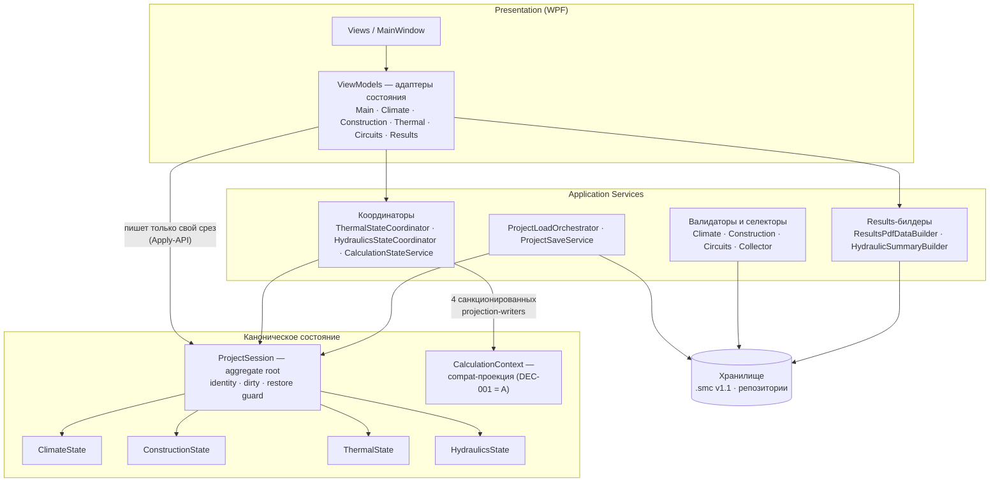

# Обзор слоёв и зависимостей

Одно WPF-приложение (`SnowMeltingCalculator`, .NET 8) и тестовый проект
(`SnowMeltingCalculator.Tests`). Зависимости направлены только вниз;
вверх — только события (`PropertyChanged`) и производные проекции.

## Правила чтения диаграммы

- **Вниз можно, вверх нельзя.** Services не зависят от ViewModels
  (инвариант; единственное исключение — ADR-002: два Results-билдера
  читают read-model записи `ViewModels.Results`).
- **ViewModel — адаптеры.** Каждый ViewModel мутирует только свой срез
  через Apply-API сессии и не хранит каноническое состояние.
- **Results — производная.** `ResultsViewModel` ничего не владеет:
  identity-редактирование идёт через сессию (`MarkDirty` — identity
  adapter, санкционирован), данные пересобираются из срезов.
- **CalculationContext — не владелец.** Это совместимостная проекция для
  расчётных сервисов; пишут её ровно четыре санкционированных projection
  writer + `MainViewModel`/`ProjectLoadOrchestrator` (DEC-001 = A).
- Контроль правил: `ArchitectureRulesTests` R1–R6 (`dotnet test`).
