# Persistence — save/load `.smc`

Формат: `ProjectData`, wire-версия **1.1**. Совместимость — инвариант:
изменение wire-shape только по отдельно одобренному решению (пиннят
fixture- и hash-тесты, см. `ProjectSnapshotContractTests`,
hash-pin characterization test).

```mermaid
flowchart TB
    subgraph SAVE["Save"]
        S1["ResultsViewModel<br/>.SaveCurrentProject"] --> S2["IProjectSaveService<br/>(ProjectSaveService)"]
        S2 --> S3["IProjectSnapshotFactory<br/>→ ProjectSnapshot<br/>(вход: IsOperatingMode)"]
        S3 --> S4["ProjectPersistenceMapper<br/>.ToProjectData"]
        S4 --> S5["ProjectData (wire v1.1)"]
        S5 --> S6[".smc файл"]
    end
    subgraph LOAD["Load / restore"]
        L1[".smc файл"] --> L2["ProjectPersistenceMapper<br/>чтение · версия · validation"]
        L2 --> L3["ProjectSnapshot"]
        L3 --> L4["ProjectLoadOrchestrator"]
        L4 --> L5["session.BeginProjectRestore()<br/>load guard"]
        L5 --> L6["срезы: ApplyProjectSnapshot /<br/>Apply / Restore"]
        L6 --> L7["расчётные проекции и перерасчёт"]
    end
```

## Факты

- **Каталоги живут только глобально** (DEC-006): материалы/шаблоны больше
  не встраиваются в `.smc`; члены `CustomMaterials`/`CustomTemplates`
  удалены с wire. Старые файлы читаются корректно — члены были
  опциональными JSON-коллекциями и при restore игнорируются.
- Вход снимка при сохранении — только `IsOperatingMode`
  (`IProjectSnapshotPersistenceInputs`); сохранение полностью асинхронное,
  sync-over-async в save-цепочке нет (grep-гейт R-набора и регрессия).
- `.smc`-фикстуры не изменяются; количество и результат
  persistence-тестов зафиксированы characterization-набором.
- RR-004: один известный skip из-за отсутствующего внешнего fixture-файла
  — записанное ограничение, не дефект.
