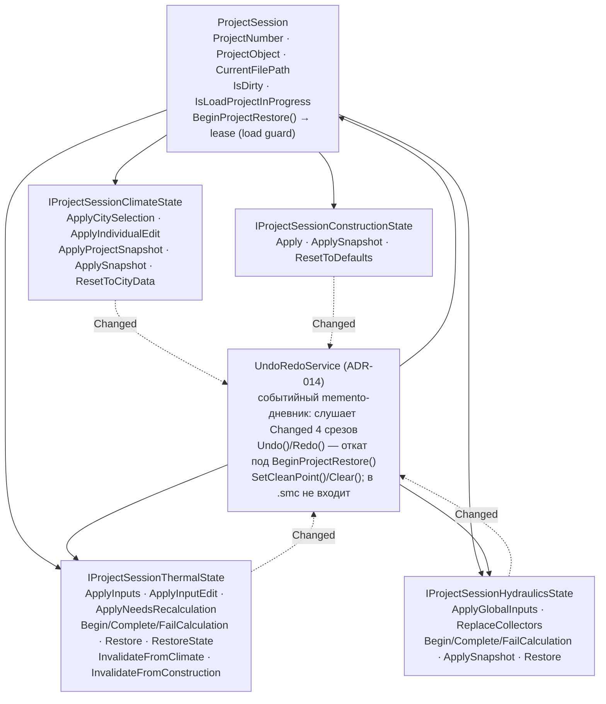

# ProjectSession — aggregate root и срезы

`src/Services/Project/ProjectSession.cs` (`ProjectSession : IProjectSession,
IMarkDirtyService`). Держит identity проекта, dirty-state и load guard;
канонические данные разделены на четыре явных среза.

## Санкционированные writers (инвариант «один writable owner»)

Списки перенесены дословно из writer-inventory фазы 10 (ADR-003); их
проверяют тесты R2/R3/R5. Расширения undo/redo — ADR-014.

| Срез / хранилище | Санкционированные writers (файлы) |
|---|---|
| ClimateState | `ProjectSessionClimateState.cs`, `ClimateViewModel.cs`, `ProjectLoadOrchestrator.cs`, `MainViewModel.cs`, `ResultsViewModel.cs`, `ProjectSession.cs`, `UndoRedoService.cs` (ADR-014) |
| ConstructionState | `ProjectSessionConstructionState.cs`, `ConstructionViewModel.cs`, `ProjectLoadOrchestrator.cs`, `MainViewModel.cs`, `ConstructionDefaultStateInitializer.cs`, `UndoRedoService.cs` (ADR-014) |
| ThermalState | `ProjectSessionThermalState.cs`, `ThermalStateCoordinator.cs` (через `_state.`), `CalculationStateService.cs`, `ProjectLoadOrchestrator.cs`, `ThermalViewModel.cs` |
| HydraulicsState | `ProjectSessionHydraulicsState.cs`, `HydraulicsStateCoordinator.cs` (через `_state.`), `CircuitsViewModel.cs`, `ProjectLoadOrchestrator.cs`, `CalculationStateService.cs`, `UndoRedoService.cs` (ADR-014) |
| Dirty / identity (`MarkDirty`/`MarkClean`) | Срезы сессии, координаторы, `ProjectSession.cs`, `ResultsViewModel.cs` (identity adapter), `MainViewModel.cs`, `UndoRedoService.cs` (точка чистоты ADR-014) |
| CalculationContext (compat-проекция, DEC-001 = A) | `ProjectSessionClimateState.cs`, `ProjectSessionConstructionState.cs`, `ThermalStateCoordinator.cs`, `HydraulicsStateCoordinator.cs`, `MainViewModel.cs`, `ProjectLoadOrchestrator.cs` |

## Правила

- ViewModel может мутировать **только свой** срез: `ClimateViewModel` →
  ClimateState, `ConstructionViewModel` → ConstructionState, и т.д.
  Чужие срезы не трогаются никогда (тест R3).
- Invalidate-поток: изменение климата/конструкции инвалидирует thermal
  (`InvalidateFromClimate/Construction`), точное количество перерасчётов
  зафиксировано characterization-тестами.
- Load guard: на время восстановления проекта `BeginProjectRestore()`
  выдаёт lease, подавляющий грязевые/реактивные эффекты; снятие —
  детерминированное.
