# Краткое руководство по расчёту системы снеготаяния

## Исходные данные (подготовить до начала)

- **Город / регион** — определяет климатические параметры (T_холодной пятидневки, ветер, влажность)
- **Интенсивность снегопада** — мм/ч (водяной эквивалент)
- **Пирог покрытия** — материалы и толщины слоёв над и под трубой
- **Уровень грунтовых вод (УГВ)** — влияет на теплопроводность нижних слоёв
- **Тип трубы** — RAUTHERM S (17/20/25 × 2.0 мм)
- **Тип и концентрация гликоля** — этиленгликоль / пропиленгликоль, 10–90 %
- **Контуры** — количество, длины, площади, подводки

---

## Шаг 1 — Климат

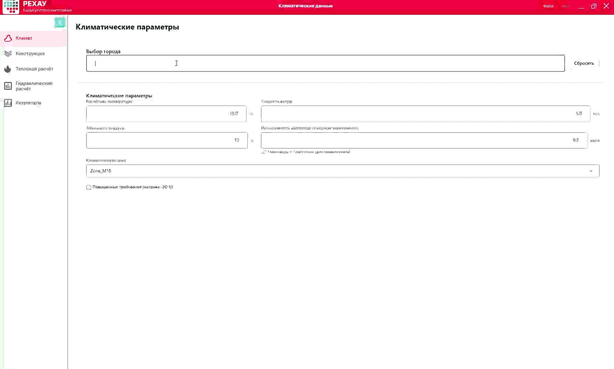

1. Ввести город в строке поиска → выбрать из списка.
2. Автозаполнятся: T_воздуха (−10 / −15 / −20 °C по T5Days092), скорость ветра, влажность, климатическая зона.
3. **Что можно изменить вручную:** T_воздуха (для более сурового микроклимата), скорость ветра / влажность (по локальным данным).

4. Кнопка **«Сбросить к данным города»** — восстанавливает авто-расчётные значения T_воздуха и ветра для выбранного города.

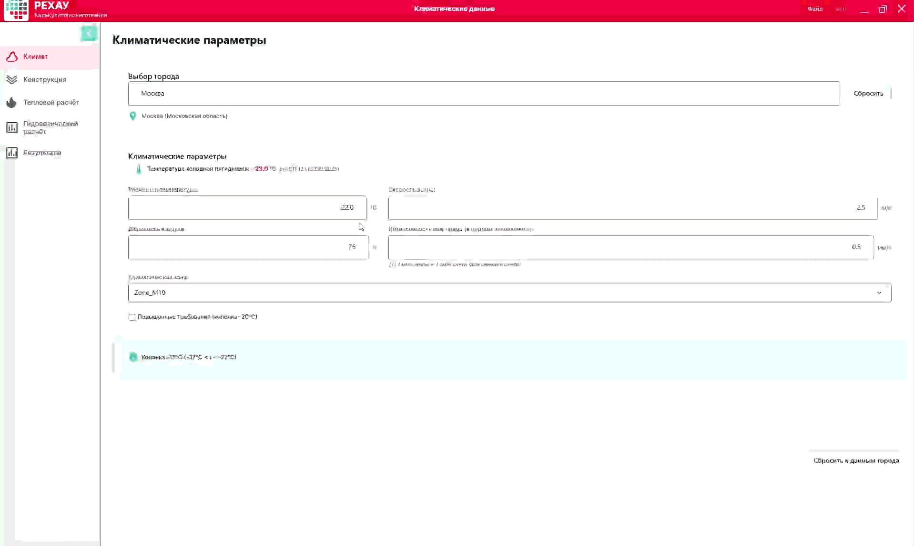

5. Флаг **«Повышенные требования»** — принудительно устанавливает T_воздуха = −20 °C.

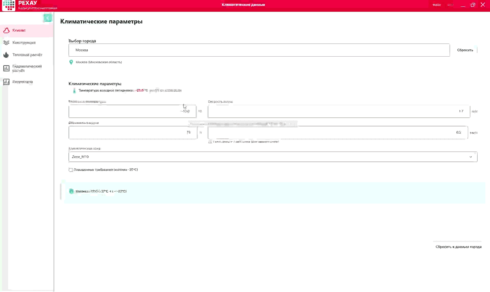

**Валидация:**
- T_воздуха: −50…+10 °C
- Ветер: 0.1–30 м/с
- Влажность: 20–100 %
- Снегопад: 0–20 мм/ч

> Перейти к следующему шагу: **«Далее»**

---

## Шаг 2 — Конструкция

1. **Добавление слоёв:** выбрать материал, задать толщину и λ (теплопроводность). Программа автоматически пересчитывает термическое сопротивление R.

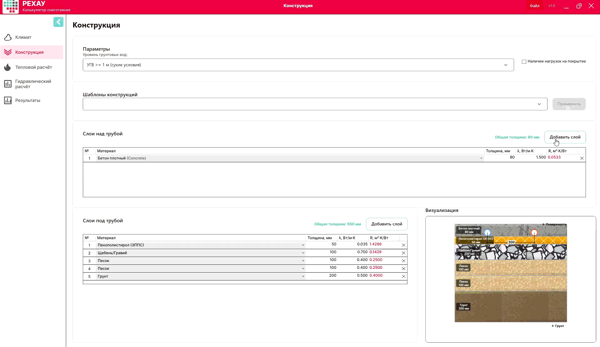

2. **Удаление слоя** — кнопка удаления рядом со слоем.

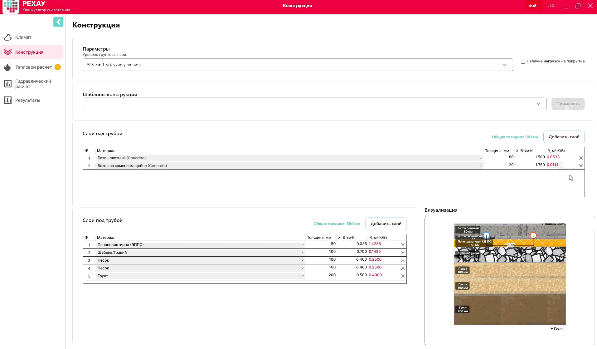

3. **Уровень грунтовых вод:**
   - УГВ ≥ 1 м → все слои под трубой используют λА (сухие условия)
   - УГВ < 1 м → все слои под трубой используют λБ (влажные условия)

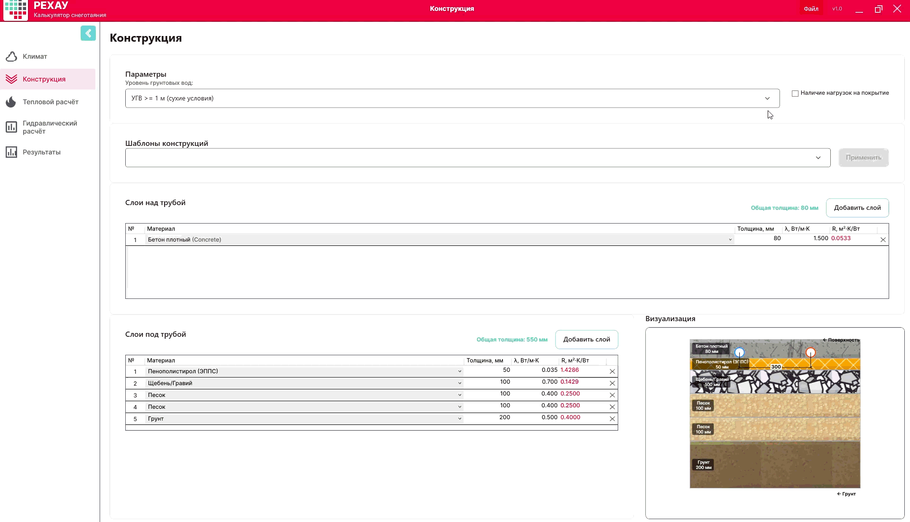

**Ограничения:**
- Суммарная толщина над трубой: ≥ 40 мм (без нагрузок) / ≥ 50 мм (с нагрузками)
- Бетон: T_подачи ≤ 50 °C (предупреждение при превышении)
- Асфальт: T_воздуха ≥ −15 °C

> Перейти к следующему шагу: **«Далее»**

---

## Шаг 3 — Тепловой расчёт

1. **Выбор режима:** Антиобледенение (+3 °C) / Таяние (+5 °C) / Интенсивный (+7 °C).
   При смене режима появляется бейдж пересчёта на вкладке. После нажатия «Рассчитать» результаты обновляются.

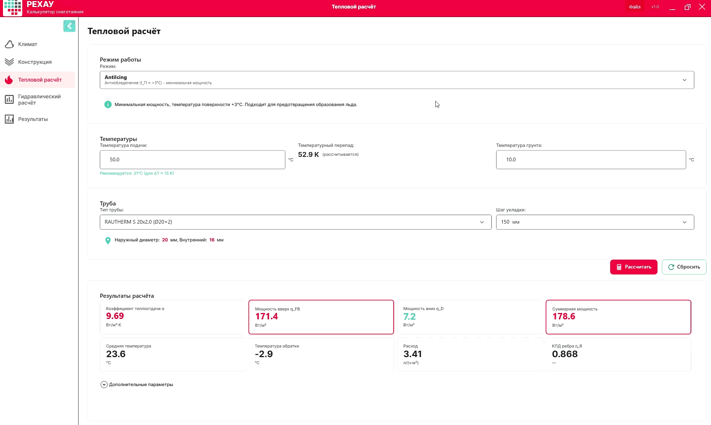

2. **Выбор трубы и шага укладки.**

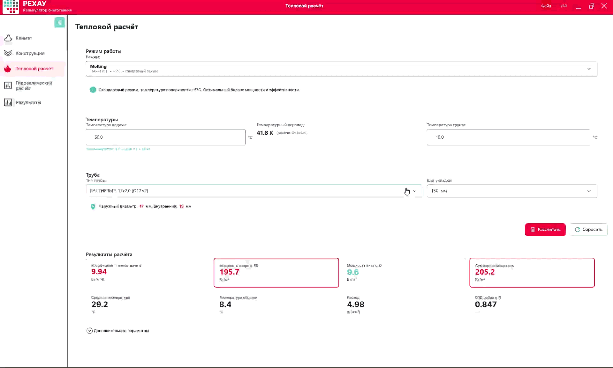

3. **Температура подачи.** Программа рекомендует ΔT ≈ 15 K. Пользователь корректирует T_подачи для достижения оптимального перепада.

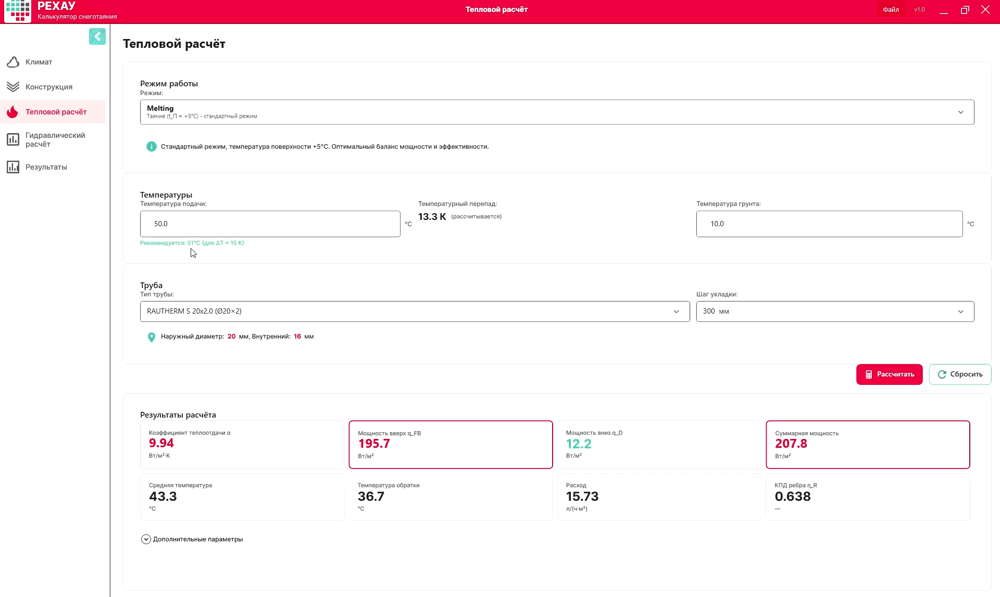

4. **Просмотр дополнительных расчётных параметров** (Q_таяние, Q_конв, КПД ребра, параметр m, сопротивления R1, R2 и др.).

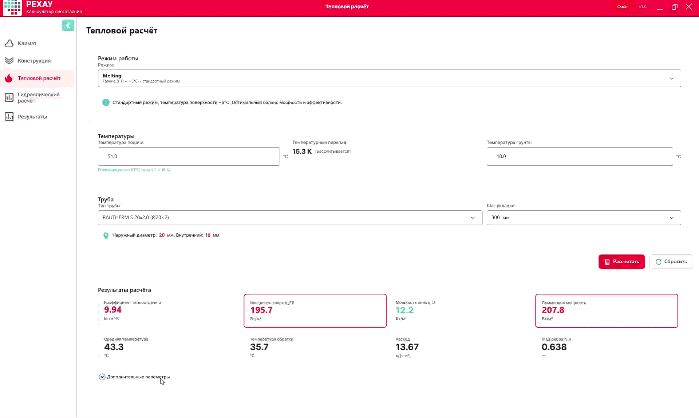

**Результаты расчёта:**
- α — коэффициент теплоотдачи (Вт/м²·К)
- PowerUp — мощность вверх (Вт/м²)
- q_D — мощность вниз (Вт/м²)
- q_total — суммарная мощность (Вт/м²)
- T_средняя, T_обратки, ΔT
- Удельный расход (л/(ч·м²))

**Проверки:**
- T_подачи > T_средняя
- ΔT ≤ 30 K
- T_обратки > T_замерзания гликоля

> Перейти к следующему шагу: **«Далее»**

---

## Шаг 4 — Гидравлика

1. **Выбор гликоля:** тип и концентрация. Свойства теплоносителя (ρ, c_p, ν, λ_тепл, Pr) пересчитываются автоматически.

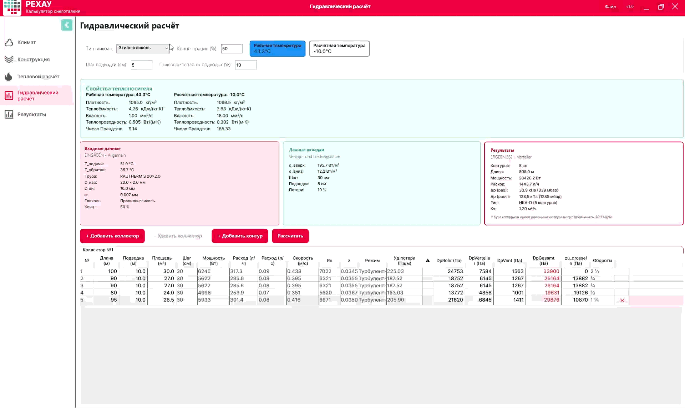

2. **Параметры подводок:** шаг подводки (по умолчанию 5 см) и доля тепла от подводок (по умолчанию 10 %).

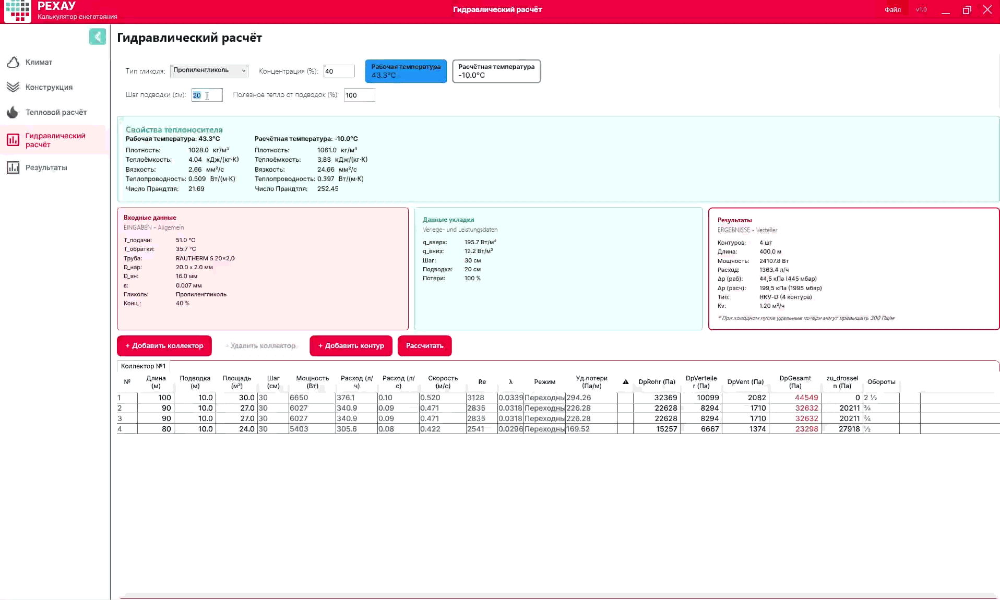

3. **Заполнение контуров:** длина или площадь. Добавление / удаление контуров.

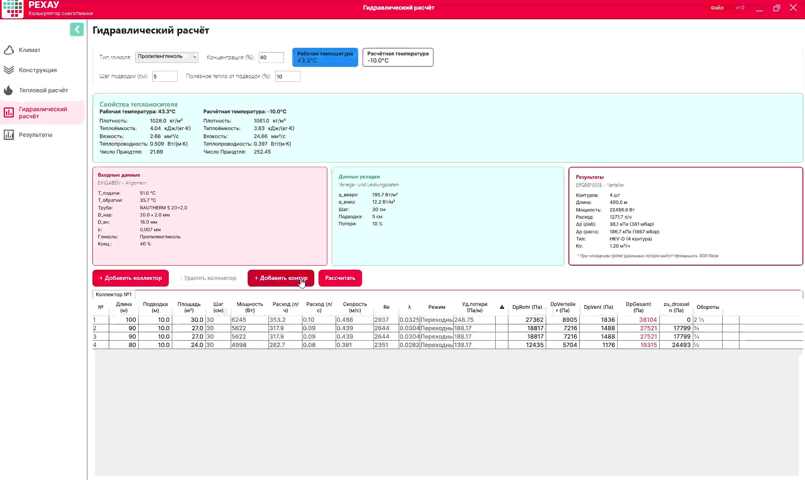

> ⚠️ **Известная особенность:** Контуры могут добавиться с шагом, отличным от заданного в тепловом расчёте. **Workaround:** перейти в Шаг 3, изменить шаг укладки, рассчитать, вернуть нужный шаг, рассчитать снова — в гидравлике шаг обновится.

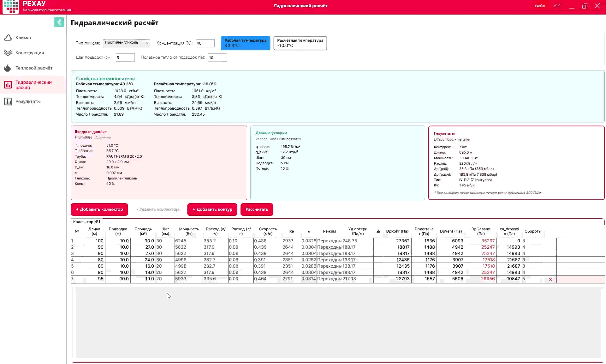

4. **Автоподбор коллектора** по суммарному расходу:

| Расход | Коллектор | Kv |
|--------|-----------|----|
| ≤ 1.5 м³/ч | HKV-D | 1.2 |
| 1.5–2.5 м³/ч | IV 1¼" | 1.45 |
| 2.5–7.0 м³/ч | IV 1½" | 1.5 |

При превышении порога 1.5 м³/ч тип коллектора в результатах меняется автоматически.

5. **Добавление коллектора, переключение между коллекторами.**

6. **Подсветка контуров** с превышением удельных потерь > 300 Па/м (поле R).

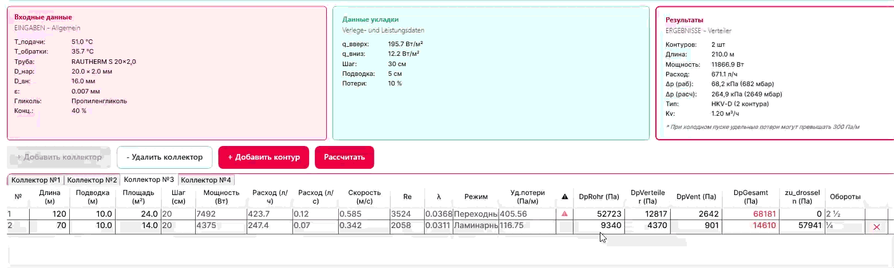

7. **Переключение режимов:** Рабочая температура / Расчётная температура (холодный пуск). При переключении все параметры пересчитываются.

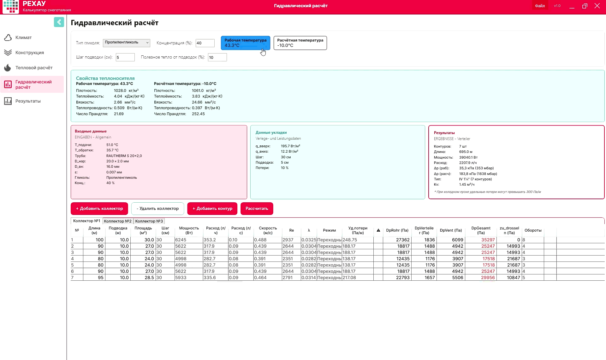

**Валидация:**
- v: 0.1–2.0 м/с
- R ≤ 300 Па/м
- Δp ≤ 320 мбар (рабочий режим)

> Перейти к следующему шагу: **«Далее»**

---

## Шаг 5 — Результаты

- **Сводка:** объект, площадь, контуры, режим, температуры, мощность, расход, коллектор, потери давления
- **Таблица контуров:** расход, скорость, Re, λ, потери, Kv, обороты вентиля
- **Параметры теплоносителя:** ρ, c_p, ν, λ_тепл, Pr при рабочей и расчётной температуре
- **Экспорт PDF**

**Сохранение проекта:** заполнить номер проекта и наименование объекта → кнопка «Сохранить».

---

## Советы

| Ситуация | Рекомендация |
|----------|-------------|
| Δp > 320 мбар (рабочий) | Уменьшить длины контуров или разделить на 2 коллектора |
| T_обратки < 0 °C | Поднять T_подачи |
| v < 0.1 м/с | Увеличить ΔT или уменьшить число контуров |
| v > 2.0 м/с | Уменьшить ΔT или увеличить число контуров |
| Длина контура > 120 м (Ø20) | Разбить на несколько контуров |
| Холодный пуск > 320 мбар | Нормально для запуска — предусмотреть насос с запасом напора |
| T_обратки < T_замерзания | Сменить гликоль на более концентрированный или поднять T_подачи |
| T_подачи > 50 °C (бетон) | Предупреждение — решение за проектировщиком |

---

## Чек-лист

- [ ] Город выбран, климатические параметры проверены
- [ ] Пирог конструкции собран, УГВ задан
- [ ] Режим работы выбран
- [ ] T_подачи скорректирована по рекомендации
- [ ] Труба и шаг укладки выбраны
- [ ] Тип и концентрация гликоля установлены
- [ ] Контуры заполнены (длина / площадь, подводки)
- [ ] Выполнен гидравлический расчёт
- [ ] Рабочий Δp ≤ 320 мбар ✓
- [ ] Холодный пуск проверен (насос с запасом)
- [ ] Проект сохранён
