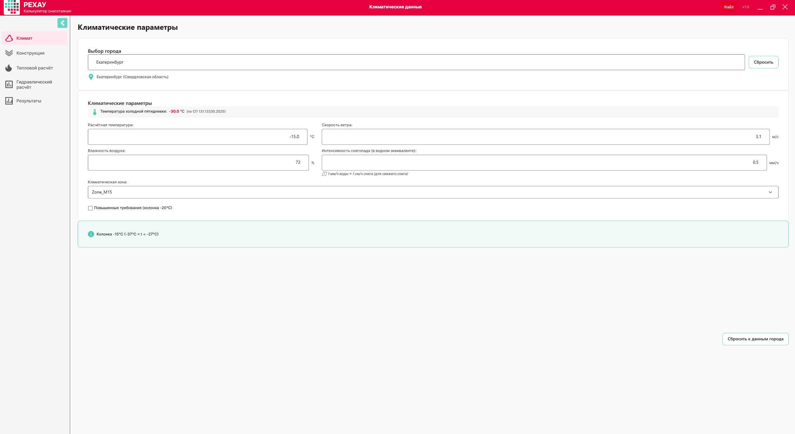
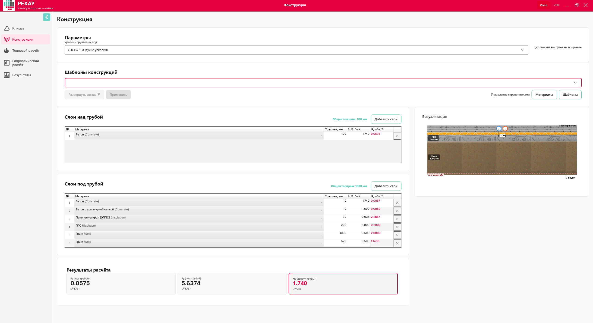
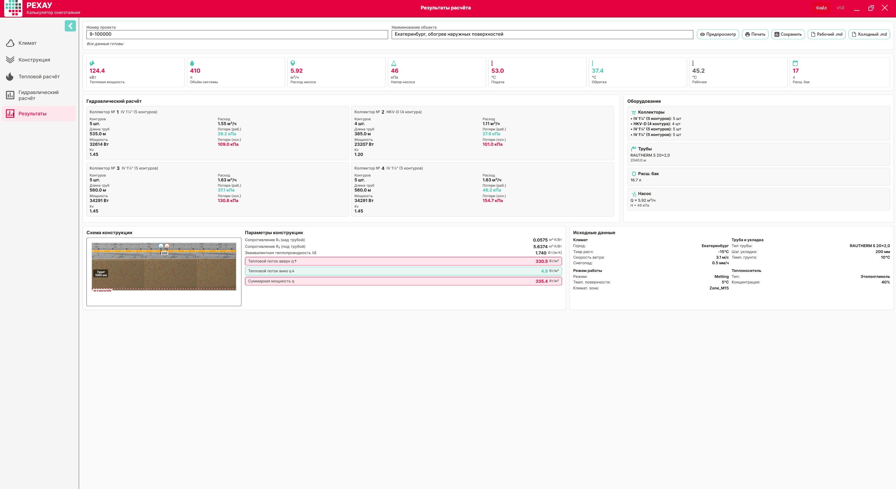

# Проект 9-100000. Екатеринбург: система снеготаяния наружных поверхностей

**Объект:** Екатеринбург, Свердловская область, обогрев наружных поверхностей
**Номер проекта:** 9-100000
**Дата расчёта:** 28.07.2026
**Цель:** снеготаяние поверхности

---

## Содержание

1. [Проектная карточка](#проектная-карточка)
2. [Быстрый итог](#быстрый-итог)
3. [Исходные данные](#исходные-данные)
4. [Порядок работы](#порядок-работы)
5. [Шаг 1. Климатические данные](#шаг-1-климатические-данные)
6. [Шаг 2. Конструкция](#шаг-2-конструкция)
7. [Шаг 3. Тепловой расчёт](#шаг-3-тепловой-расчёт)
8. [Шаг 4. Гидравлический расчёт](#шаг-4-гидравлический-расчёт)
9. [Шаг 5. Результаты](#шаг-5-результаты)
10. [Контрольные проверки](#контрольные-проверки)
11. [Troubleshooting](#troubleshooting)
12. [Финальный чек-лист](#финальный-чек-лист)
13. [Источники данных](#источники-данных)

---

## Проектная карточка

| Параметр | Значение |
| --- | --- |
| Город, регион | Екатеринбург, Свердловская область |
| Климатическая зона | zone_M15 |
| Расчётная температура воздуха | −15 °C |
| Скорость ветра | 3,1 м/с |
| Относительная влажность | 72 % |
| Интенсивность снегопада | 0,5 мм/ч |
| Повышенные требования | нет |
| Уровень грунтовых вод | 2 м |
| Нагрузки на покрытие | да (hasLoads = true) |
| Труба | RAUTHERM S 20×2,0 |
| Шаг укладки | 200 мм |
| Теплоноситель | этиленгликоль 40 % |
| Температура подачи / обратки | 53,0 / 37,36 °C |
| Средняя температура / ΔT | 45,18 °C / 15,64 К |
| q_up / q_down / q_total | 330,49 / 4,88 / 335,36 Вт/м² |
| Подводка к коллектору | 10 м на контур |
| Шаг подводки | 5 см |
| Полезное тепло подводки | 10 % |

---

## Быстрый итог

- Расчёт в файле `Тест/Екат.smc` содержит **4 сохранённых коллектора** с **19 рассчитанными контурами**.
- Общая длина трубы по всем коллекторам: **2040 м**, из них **1850 м петель** и **190 м подводок** (19 × 10 м).
- Суммарная тепловая мощность: **124,403 кВт**.
- Суммарный объёмный расход: **5,924 м³/ч**.
- Гидравлически определяющий контур: **контур 4 коллектора 4** (рабочие потери **46,226 кПа**, холодные **154,667 кПа**).
- Все четыре коллектора рассчитаны полностью; нерассчитанных контуров в файле нет.

---

## Исходные данные

### Климатические параметры

| Параметр | Значение | Источник |
| --- | --- | --- |
| Город | Екатеринбург | `data/climate_db.json` |
| Температура воздуха | −15 °C | zone_M15 |
| Скорость ветра | 3,1 м/с | `wind_avg_t_le_8` |
| Влажность | 72 % | `humidity_15h_cold` |
| Интенсивность снегопада | 0,5 мм/ч | задана вручную |
| Климатическая зона | zone_M15 | автоматический выбор |

### Конструкция (пирог покрытия)

**Слои над трубой:**

| № | Материал | Толщина, мм | λ, Вт/(м·К) |
| --- | --- | --- | --- |
| 1 | Бетон | 100 | 1,74 |

**Слои под трубой:**

| № | Материал | Толщина, мм | λ, Вт/(м·К) |
| --- | --- | --- | --- |
| 1 | Бетон | 10 | 1,74 |
| 2 | Бетон с арматурной сеткой | 10 | 1,69 |
| 3 | Пенополистирол (ЭППС) | 80 | 0,035 |
| 4 | Песчано-гравийная смесь (ПГС) | 200 | 1,00 |
| 5 | Грунт | 1000 | 0,50 |
| 6 | Грунт | 570 | 0,50 |

| Результат конструкции | Значение |
| --- | --- |
| R1 (сопротивление над трубой) | 0,057 м²·К/Вт |
| R2 (сопротивление под трубой) | 5,637 м²·К/Вт |
| λE | 1,74 Вт/(м·К) |
| УГВ | 2 м (сухие условия) |
| Нагрузки | да |

### Тепловые и гидравлические параметры

| Параметр | Значение |
| --- | --- |
| Режим работы | Таяние |
| Температура грунта | 10 °C |
| Температура подачи | 53,0 °C |
| Температура обратки | 37,36 °C |
| Средняя температура | 45,18 °C |
| ΔT | 15,64 К |
| q_up | 330,49 Вт/м² |
| q_down | 4,88 Вт/м² |
| q_total | 335,36 Вт/м² |
| Тип трубы | RAUTHERM S 20×2,0 |
| Шаг укладки | 200 мм |
| Теплоноситель | этиленгликоль 40 % |
| Длина подводки | 10 м на контур |
| Шаг подводки | 5 см |
| Полезное тепло подводки | 10 % |

---

## Порядок работы

1. **Климат.** Выбрать город, проверить температуру, ветер, влажность, снегопад.
2. **Конструкция.** Собрать пирог покрытия, задать УГВ и признак нагрузок.
3. **Тепловой расчёт.** Выбрать режим, трубу, шаг, температуру подачи и нажать «Рассчитать».
4. **Гидравлика.** Задать теплоноситель, подводки, длины контуров, рассчитать и увязать потери.
5. **Результаты.** Проверить сводку, сравнить с `.smc`, экспортировать отчёт.

---

## Шаг 1. Климатические данные

### Что видит пользователь

Поле поиска города, поля температуры, скорости ветра, влажности, интенсивности снегопада, флаг «Повышенные требования» и кнопка «Сбросить к данным города».

### Действия

1. Введите **Екатеринбург**.
2. Выберите пункт из списка.
3. Проверьте, что все параметры совпадают с таблицей выше.
4. Нажмите **«Далее»**.

### Автозаполнение

После выбора города программа подставляет:

- температуру −15 °C;
- скорость ветра 3,1 м/с;
- влажность 72 %;
- зону zone_M15.

Интенсивность снегопада 0,5 мм/ч задаётся вручную.

### Валидация

| Параметр | Допустимый диапазон |
| --- | --- |
| Температура воздуха | от −50 до +10 °C |
| Скорость ветра | от 0,1 до 30 м/с |
| Влажность | от 20 до 100 % |
| Интенсивность снегопада | от 0 до 20 мм/ч |

---

## Шаг 2. Конструкция

### Что видит пользователь

Конструктор слоёв: две колонки «Над трубой» и «Под трубой», список материалов, поля толщины и λ, поле «Уровень грунтовых вод».

### Действия

1. Добавьте слой над трубой: **Бетон 100 мм**.
2. Добавьте слои под трубой в порядке, указанном в таблице «Конструкция».
3. Установите **УГВ = 2 м**.
4. Установите признак **нагрузки на покрытие**.
5. Нажмите **«Далее»**.

### Результаты расчёта конструкции

| Параметр | Значение |
| --- | --- |
| R1 | 0,057 м²·К/Вт |
| R2 | 5,637 м²·К/Вт |
| λE | 1,74 Вт/(м·К) |

---

## Шаг 3. Тепловой расчёт

### Что видит пользователь

Выпадающие списки «Режим работы» и «Тип трубы», поля температуры подачи, температуры грунта, шага укладки и кнопка «Рассчитать».

### Действия

1. Режим работы: **Таяние** (+5 °C).
2. Тип трубы: **RAUTHERM S 20×2,0**.
3. Шаг укладки: **200 мм**.
4. Температура грунта: **10 °C**.
5. Температура подачи: **53 °C**.
6. Нажмите **«Рассчитать»**, затем **«Далее»**.

### Результаты

| Параметр | Значение |
| --- | --- |
| Температура подачи | 53,0 °C |
| Температура обратки | 37,36 °C |
| Средняя температура | 45,18 °C |
| ΔT | 15,64 К |
| q_up | 330,49 Вт/м² |
| q_down | 4,88 Вт/м² |
| q_total | 335,36 Вт/м² |

---

## Шаг 4. Гидравлический расчёт

### Что видит пользователь

Таблица контуров, свойства теплоносителя, параметры коллектора, переключатель «Рабочая температура / Расчётная температура» и кнопка «Рассчитать».

### Действия

1. Тип теплоносителя: **этиленгликоль 40 %**.
2. Режим температуры: **Рабочая температура**.
3. Длина подводки: **10 м** на каждый контур.
4. Шаг подводки: **5 см**.
5. Полезное тепло подводки: **10 %**.
6. Заполните количество контуров и длины петель по таблицам ниже.
7. Нажмите **«Рассчитать»**.

> **Примечание о длине.** Длина контура в `.smc` (`circuitLength`) не включает 10 м подводки. Поле `summary.totalPipeLength` включает подводки для рассчитанных контуров. Поэтому сумма длин петель по таблицам меньше сводного значения ровно на суммарную длину подводок.

### Сводка по коллекторам

> Тип коллектора принят по верхнему полю `collectorType` в `.smc`, а не по вложенному `summary.collectorType`. Для коллекторов № 1, № 3 и № 4 верхнее поле содержит IV 1¼″, а вложенное `summary.collectorType` — HKV-D. В инструкции используется верхнее поле и соответствующее значение Kv.

| Коллектор | Тип | Kv | Контуров | Длина, м | Мощность, кВт | Расход, м³/ч | ΣΔP раб, кПа | ΣΔP хол, кПа |
| --- | --- | --- | --- | --- | --- | --- | --- | --- |
| 1 | IV 1¼″ | 1,45 | 5 | 535 | 32,614 | 1,553 | 29,199 | 109,002 |
| 2 | HKV-D | 1,20 | 4 | 385 | 23,207 | 1,105 | 27,856 | 101,030 |
| 3 | IV 1¼″ | 1,45 | 5 | 560 | 34,291 | 1,633 | 37,099 | 130,840 |
| 4 | IV 1¼″ | 1,45 | 5 | 560 | 34,291 | 1,633 | 46,226 | 154,667 |
| **Итого** | | | **19** | **2040** | **124,403** | **5,924** | | |

### Таблицы контуров

Единицы: петля и подводка — м; Q — кВт; G — л/ч; v — м/с; ΔP — кПа.

#### Коллектор 1. 5 контуров

| Контур | Петля | Подв. | Q | G | v | ΔP раб. | ΔP хол. | Обороты |
| --- | ---: | ---: | ---: | ---: | ---: | ---: | ---: | ---: |
| 1 | 100 | 10 | 6,724 | 320,183 | 0,442 | 29,199 | 109,002 | 8,00 |
| 2 | 95 | 10 | 6,389 | 304,213 | 0,420 | 25,686 | 98,829 | 5,50 |
| 3 | 90 | 10 | 6,053 | 288,244 | 0,398 | 22,452 | 89,154 | 4,50 |
| 4 | 100 | 10 | 6,724 | 320,183 | 0,442 | 29,199 | 109,002 | 8,00 |
| 5 | 100 | 10 | 6,724 | 320,183 | 0,442 | 29,199 | 109,002 | 8,00 |

#### Коллектор 2. 4 контура

| Контур | Петля | Подв. | Q | G | v | ΔP раб. | ΔP хол. | Обороты |
| --- | ---: | ---: | ---: | ---: | ---: | ---: | ---: | ---: |
| 1 | 80 | 10 | 5,383 | 256,306 | 0,354 | 18,317 | 72,856 | 0,75 |
| 2 | 80 | 10 | 5,383 | 256,306 | 0,354 | 18,317 | 72,856 | 0,75 |
| 3 | 90 | 10 | 6,053 | 288,244 | 0,398 | 24,400 | 91,129 | 1,25 |
| 4 | 95 | 10 | 6,389 | 304,213 | 0,420 | 27,856 | 101,030 | 2,50 |

#### Коллектор 3. 5 контуров

| Контур | Петля | Подв. | Q | G | v | ΔP раб. | ΔP хол. | Обороты |
| --- | ---: | ---: | ---: | ---: | ---: | ---: | ---: | ---: |
| 1 | 100 | 10 | 6,724 | 320,183 | 0,442 | 29,199 | 109,002 | 4,50 |
| 2 | 110 | 10 | 7,395 | 352,121 | 0,486 | 37,099 | 130,840 | 8,00 |
| 3 | 100 | 10 | 6,724 | 320,183 | 0,442 | 29,199 | 109,002 | 4,50 |
| 4 | 100 | 10 | 6,724 | 320,183 | 0,442 | 29,199 | 109,002 | 4,50 |
| 5 | 100 | 10 | 6,724 | 320,183 | 0,442 | 29,199 | 109,002 | 4,50 |

#### Коллектор 4. 5 контуров

| Контур | Петля | Подв. | Q | G | v | ΔP раб. | ΔP хол. | Обороты |
| --- | ---: | ---: | ---: | ---: | ---: | ---: | ---: | ---: |
| 1 | 90 | 10 | 6,053 | 288,244 | 0,398 | 22,452 | 89,154 | 2,75 |
| 2 | 100 | 10 | 6,724 | 320,183 | 0,442 | 29,199 | 109,002 | 3,50 |
| 3 | 100 | 10 | 6,724 | 320,183 | 0,442 | 29,199 | 109,002 | 3,50 |
| 4 | 120 | 10 | 8,066 | 384,059 | 0,531 | 46,226 | 154,667 | 8,00 |
| 5 | 100 | 10 | 6,724 | 320,183 | 0,442 | 29,199 | 109,002 | 3,50 |

---

## Шаг 5. Результаты

### Что видит пользователь

Финальная сводка, схема конструкции, таблица контуров, параметры теплоносителя и кнопка экспорта PDF.

### Итоговая сводка по файлу `.smc`

| Параметр | Значение |
| --- | --- |
| Общее число рассчитанных контуров | 19 |
| Общая длина петель (без подводок) | 1850 м |
| Общая длина подводок | 190 м |
| Общая длина трубы (с подводками) | 2040 м |
| Суммарная мощность | 124,403 кВт |
| Суммарный расход | 5,924 м³/ч |
| Максимальные рабочие потери | 46,226 кПа (контур 4 коллектора 4) |
| Максимальные холодные потери | 154,667 кПа (контур 4 коллектора 4) |

> Объём системы и расширительный бак не представлены непосредственно в `.smc` и не входят в числовой источник данной инструкции. Эти параметры при необходимости определяются отдельным проектным расчётом.

### Экспорт отчёта

1. Перейдите на вкладку **«Результаты»**.
2. Нажмите **«Предпросмотр»**.
3. Проверьте все страницы, затем используйте **«Сохранить»** или **«Печать»**.

---

## Контрольные проверки

| Проверка | Лимит | Факт | Статус |
| --- | --- | --- | --- |
| Минимальная скорость | ≥ 0,1 м/с | 0,354 м/с | пройдено |
| Максимальная скорость | ≤ 2,0 м/с | 0,531 м/с | пройдено |
| Удельные потери на метр | ≤ 300 Па/м | 280 Па/м | пройдено |
| Рабочие потери по определяющему контуру | проверить по паспорту коллектора | 46,226 кПа | требует проверки |
| Холодные потери | проверить по насосу | 154,667 кПа | требует насоса с запасом напора |
| Температура подачи | ≤ 50 °C для бетона | 53 °C | программа покажет предупреждение |
| Сумма длины по коллекторам | 2040 м | 535 + 385 + 560 + 560 = 2040 м | совпадает |
| Сумма мощности | 124,403 кВт | 32,614 + 23,207 + 34,291 + 34,291 = 124,403 кВт | совпадает |
| Сумма расхода | 5,924 м³/ч | 1,553 + 1,105 + 1,633 + 1,633 = 5,924 м³/ч | совпадает |

---

## Troubleshooting

| Проблема | Причина | Решение |
| --- | --- | --- |
| Рабочие потери требуют проверки | Контур 4 коллектора 4: петля 120 м и максимальные потери | Сверить допустимые потери и насос с паспортами оборудования; при необходимости скорректировать контур |
| Холодные потери > 100 кПа | Высокая вязкость при −15 °C | Предусмотреть насос с запасом по напору и частотным регулированием |
| Предупреждение по температуре подачи | 53 °C выше max_supply_temp бетона (50 °C) | Согласовать в проекте или снизить подачу до 50 °C с уточнением расхода |

---

## Финальный чек-лист

- [ ] Город и климатические параметры совпадают с zone_M15.
- [ ] Пирог покрытия соответствует слоям из `.smc`.
- [ ] Тепловой расчёт: 53 / 37,36 / 45,18 °C, ΔT 15,64 К, q_total 335,36 Вт/м².
- [ ] Гидравлика: этиленгликоль 40 %, подводка 10 м, шаг 5 см, 10 % полезного тепла.
- [ ] Все таблицы контуров сходятся с `.smc`.
- [ ] Контрольные суммы: 19 контуров, 2040 м, 124,403 кВт, 5,924 м³/ч.
- [ ] Предупреждения по температуре подачи и давлению учтены в проекте.
- [ ] Предпросмотр PDF проверен.
- [ ] Отчёт готов к выпуску.

---

## Источники данных

- `Тест/Екат.smc` — главный числовой источник проекта.
- `data/climate_db.json` — климатические параметры Екатеринбурга.
- `data/materials_db.json` — материалы пирога покрытия.
- `data/rehau_products.json` — трубы и коллекторы RAUTHERM S / HKV-D.
- `data/glycol_data.json` — свойства теплоносителя.
- `docs/инструкция/README v.2.1.md` — структурный образец документа.
- `Презентация/*.PNG` — скриншоты интерфейса для иллюстрации.

---

*Версия инструкции: 2.2 · Расчёт выполнен в калькуляторе снеготаяния*