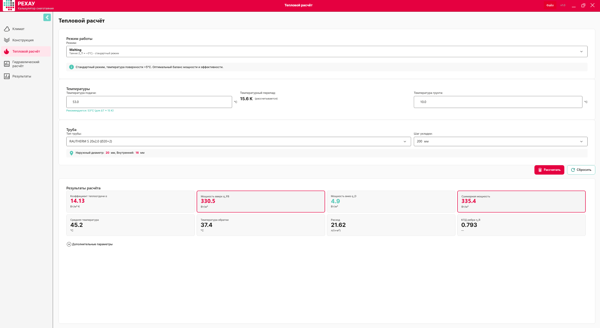
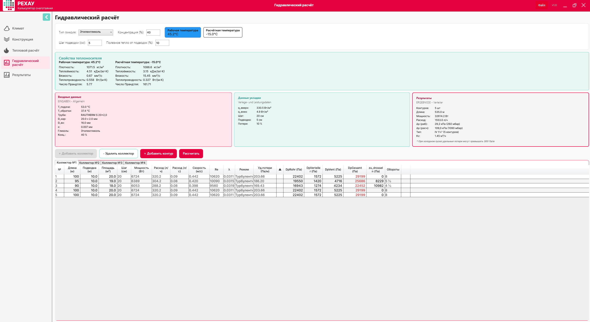
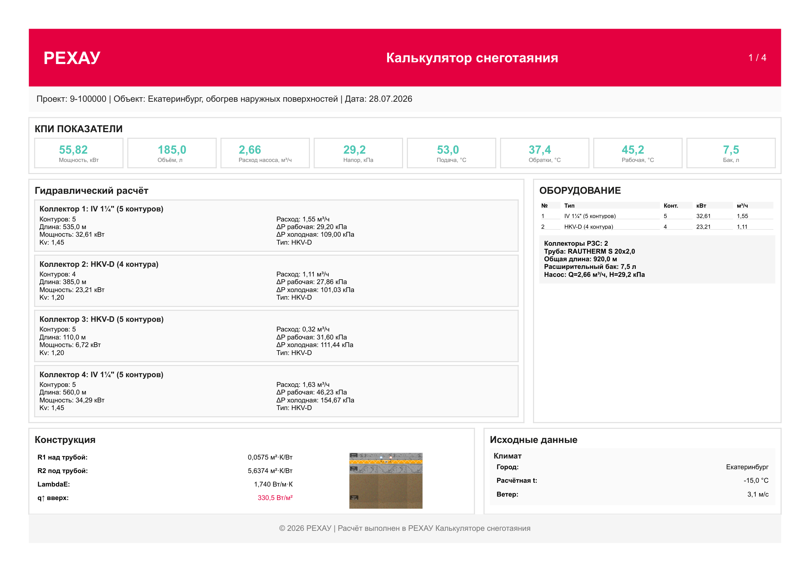
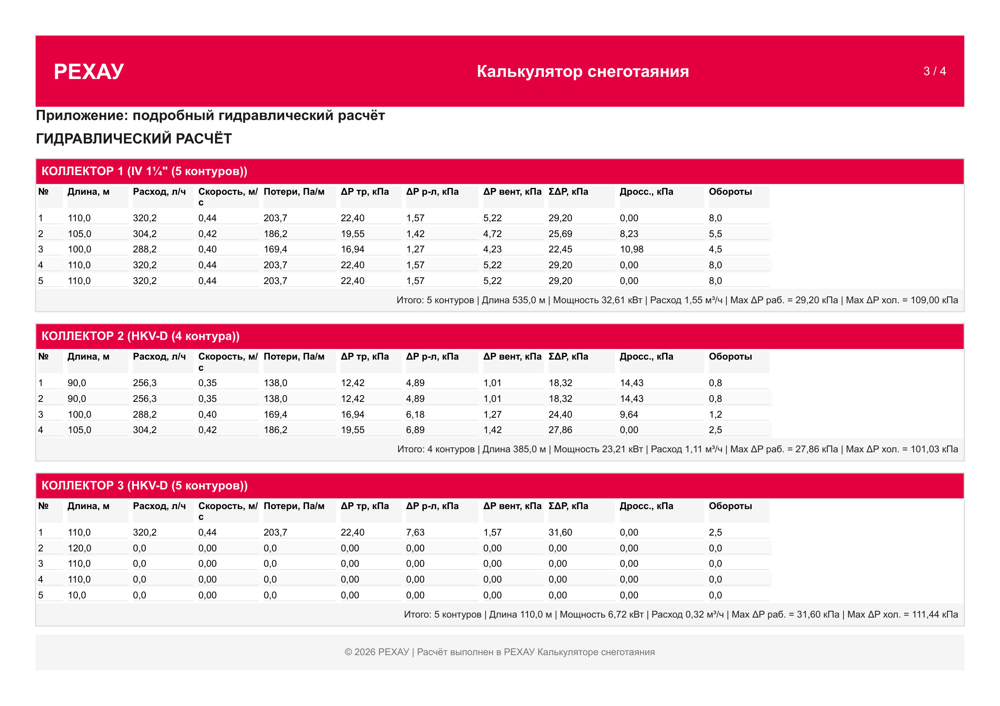

# SnowMeltingCalculator — Руководство пользователя

**Версия документа:** 2.3 (kimi)
**Дата редакции:** 28.07.2026
**Статус:** Актуальная
**Пример расчёта:** Екатеринбург, обогрев наружных поверхностей (проект № 9-100000, файл `Екат.smc`), 370 м²

---

## 📑 Оглавление

1. [Как пользоваться этим руководством](#-как-пользоваться-этим-руководством)
2. [Подготовка к расчёту (чеклист)](#-подготовка-к-расчёту-чеклист)
3. [Быстрый старт за 10 минут](#-быстрый-старт-за-10-минут)
4. [Исходные данные примера](#-исходные-данные-для-расчёта)
5. [Шаг 1 — Климатические данные](#-шаг-1--климатические-данные)
6. [Шаг 2 — Конструкция (пирог покрытия)](#-шаг-2--конструкция-пирог-покрытия)
7. [Шаг 3 — Тепловой расчёт](#-шаг-3--тепловой-расчёт)
8. [Шаг 4 — Гидравлический расчёт](#-шаг-4--гидравлический-расчёт)
9. [Шаг 5 — Результаты, холодный пуск и отчёт](#-шаг-5--результаты-холодный-пуск-и-отчёт)
10. [Устранение ошибок](#-что-делать-если-руководство-по-устранению-ошибок)
11. [Работа с файлами проектов](#-работа-с-файлами-проектов)
12. [Глоссарий обозначений](#-глоссарий-обозначений)

---

## 📖 Как пользоваться этим руководством

Документ построен как сквозной пример: от ввода климата до экспорта PDF-отчёта на реальном объекте. Каждый шаг имеет единую структуру:

| Блок | Назначение |
| --- | --- |
| **Что видит пользователь** | Описание экрана и элементов управления |
| ▶️ **Действия пользователя** | Пошаговая инструкция «что нажать и что ввести» |
| 🤖 **Что рассчиталось автоматически** | Прозрачная математика ядра — для проверки корректности |
| 🔍 **Валидации** | Системные ограничения, зашитые в код программы |
| 🧭 **Навигация** | Переход к следующему шагу |

**Условные обозначения в тексте:**

> ℹ️ **Примечание** — полезный контекст, можно пропустить при первом чтении.

> ⚠️ **Предупреждение** — программа посчитает, но ответственность на инженере.

> ❌ **Критично** — требует обязательного инженерного решения.

> ✏️ **Как изменить вручную** — способы переопределить автоматику.

---

## ✅ Подготовка к расчёту (чеклист)

Перед запуском программы подготовьте следующие данные — это сократит время расчёта до 10–15 минут:

- [ ] **Город / площадка объекта** — для автоподстановки климата по СП 131.13330.2025.
- [ ] **Обогреваемая площадь** и желаемая разбивка на зоны и контуры (эскиз раскладки).
- [ ] **Количество коллекторов** — для крупных объектов (>150 м²) систему целесообразно делить на несколько распределительных узлов.
- [ ] **Конструкция покрытия**: состав и толщина слоёв над и под трубой.
- [ ] **Уровень грунтовых вод (УГВ)** — из отчёта об инженерно-геологических изысканиях.
- [ ] **Тип покрытия** (бетон / асфальт / плитка) — влияет на температурные ограничения.
- [ ] **Режим работы системы**: «Таяние» (+5 °C) или «Антиобледенение» (+3 °C).
- [ ] **Тип теплоносителя** и концентрация гликоля (экологические требования объекта).
- [ ] **Расстояние от коллекторов** до зон обогрева (длины подводок).

---

## 🚀 Быстрый старт за 10 минут

Краткий маршрут без формул — для тех, кому нужен результат прямо сейчас. Детали и математика — в соответствующих главах.

| Шаг | Что сделать | Результат в примере |
| :-: | --- | --- |
| **1** | Введите город, проверьте автозаполнение, задайте снегопад | Екатеринбург, T_воздуха −15 °C, снегопад 0.5 мм/ч |
| **2** | Соберите пирог: 1 слой над трубой, 6 слоёв под трубой, УГВ 2.0 м | R1 = 0.0575, R2 = 5.6374 м²·К/Вт |
| **3** | Режим «Таяние», труба RAUTHERM S 20×2.0, шаг 200 мм → **«Рассчитать»** → примите рекомендацию T_подачи | q_Total = 335.4 Вт/м², график 53/37.4 °C |
| **4** | Этиленгликоль 40 %, настройте 4 коллектора и 19 контуров → **«Рассчитать»** | Расход 5.92 м³/ч, Δp_раб 279–462 мбар |
| **5** | Переключите на «Расчётная температура», оцените холодный пуск, экспортируйте PDF | Насос ≥ 15.5 м вод. ст., отчёт готов |

---

## 📋 Исходные данные для расчёта

**Объект:** Екатеринбург, обогрев наружных поверхностей (проект № 9-100000)
**Обогреваемая площадь:** 370 м² (19 контуров на 4 коллекторах, зона с нагрузками)
**Цель:** снеготаяние поверхности

| Что | Значение | Почему |
| --- | --- | --- |
| Город | Екатеринбург (Свердловская область) | Для климатических параметров (T5Days092, ветер, влажность) |
| Интенсивность снегопада | 0.5 мм/ч (умеренный снегопад) | Снег тает на поверхности |
| Температура поверхности (режим) | +5 °C (Таяние) | Стандартный режим для активного снеготаяния |
| Пирог конструкции | Бетон 100 мм + ЭППС 80 мм + основание из ПГС и грунта | Монолитная конструкция с мощным утеплением и массивным основанием |
| Уровень грунтовых вод | 2.0 м (сухие условия) | Влияет на теплопроводность нижних слоёв (λА) |
| Труба | RAUTHERM S 20×2.0, шаг 200 мм | При шаге 200 мм общая длина трубы 1850 м (контуры) + 190 м (подводки) = 2040 м |
| Теплоноситель | Этиленгликоль 40 об.% — выбирается на Шаге 4 | Морозостойкость для уральского климата |

> ℹ️ **Климат Екатеринбурга:** Холодная пятидневка −30 °C переводит объект в климатическую зону **Zone_M15** с расчётной температурой **−15 °C**, а средний ветер 3.1 м/с заметно усиливает конвективные потери с поверхности. Итоговая удельная мощность системы — **335.4 Вт/м²**.

---

## 🌤️ Шаг 1 — Климатические данные

### Что видит пользователь
Поле поиска города, под ним поля: **T_воздуха**, **скорость ветра**, **влажность**, **интенсивность снегопада**, флаг **«Повышенные требования»**, кнопка **«Сбросить к данным города»**.

### ▶️ Действия пользователя
1. Введите в строку поиска значение **«Екатеринбург»**.
2. Выберите из выпадающего списка пункт **«Екатеринбург (Свердловская область)»**.

### 🤖 Что заполнилось автоматически (из `data/climate_db.json`)

| Поле | Значение | Откуда |
| --- | --- | --- |
| T_холодной пятидневки (T5Days092) | −30 °C | СП 131.13330.2025 |
| Расчётная температура T_воздуха | −15 °C | −37 < T5Days092 < −27 → колонка −15 °C (таблица 1.6) |
| Скорость ветра | 3.1 м/с | wind_avg_t_le_8 |
| Влажность | 72 % | humidity_15h_cold |
| Климатическая зона | Zone_M15 | Авто |

**Логика автовыбора расчётной температуры (таблица 1.6, СП 131.13330.2025):**

| T5Days092 (хол. пятидневка) | Расчётная T_воздуха | Климатическая зона |
|---|---|---|
| ≥ −27 °C | −10 °C | Zone_M10 |
| от −37 до −27 °C | **−15 °C** ← *наш случай (−30 °C)* | **Zone_M15** |
| ≤ −37 °C | −20 °C | Zone_M20 |
| Повышенные требования (флаг) | −20 °C | Zone_M20_Plus |

> ✏️ **Как изменить вручную:**
> 1. Введите любое значение от −50 до +10 °C непосредственно в поле **T_воздуха** — программа использует его для расчёта, а в скобках покажет базовое значение по городу.
> 2. Включите флаг **«Повышенные требования»** — T_воздуха принудительно станет −20 °C независимо от выбранного города.
> 3. Нажмите **«Сбросить к данным города»** — вернётся авто-расчётное значение по таблице выше.

### ⚙️ Что можно изменить вручную
*   **T_воздуха:** ввести значение вручную, например `-20 °C`, если площадка расположена на открытом продуваемом участке.
*   **Скорость ветра / влажность:** скорректировать при наличии точных локальных данных от метеослужб. Для Екатеринбурга базовое значение ветра `3.1 м/с` уже учитывает регулярные уральские ветра.
*   **Интенсивность снегопада:** введите вручную значение `0.5` мм/ч (умеренный снегопад).
*   **Повышенные требования:** если включить этот флаг, расчетное значение **T_воздуха** автоматически изменится на `-20 °C` (критично для ответственных объектов: вокзалы, медицинские учреждения).

> ⚠️ **Асфальт в условиях Екатеринбурга (справочно):** При расчётной температуре `−15 °C` материалы «Асфальт» и «Асфальтобетон» находятся ровно на границе допустимого (`min_outdoor_temp = −15 °C`), а при флаге «Повышенные требования» (−20 °C) — за ней. Автоматическая валидация этого лимита появится в следующей версии программы; в текущей версии выбор покрытия контролирует проектировщик — рекомендуем бетон или плитку (подробнее см. в Шаге 2).

### 🔍 Валидации (зашиты в коде программы)

Программа автоматически проверяет корректность введенных пользователем данных. Вводимые значения должны строго соответствовать константам из `ValidationConstants`:

*   **T_воздуха:** от `-50` до `+10` °C
*   **Скорость ветра:** от `0.1` до `30` м/с
*   **Влажность:** от `20` до `100` %
*   **Интенсивность снегопада:** от `0` до `20` мм/ч

> ⚠️ **Что делать при ошибке валидации:**
> Если вы ввели некорректные данные и система подсветила поля ошибкой, нажмите на кнопку **«Сбросить к данным города»** — это вернет все авто-расчётные значения по умолчанию.

### 🧭 Навигация и статусы шагов

В боковой панели слева отображаются 5 шагов настройки.
*   **Красный бейдж (значок):** Появляется рядом с названием следующего шага после изменения любых данных на текущем экране. Это означает, что данные изменились и требуется актуализация расчетов.
*   **Действие:** Чтобы обновить расчет, перейдите на соответствующий шаг и нажмите кнопку **«Рассчитать»** (или **«Далее»**).

Нажмите кнопку **«Далее»**, чтобы перейти к следующему этапу.

---

## 🏗️ Шаг 2 — Конструкция (пирог покрытия)

### Что видит пользователь
Конструктор слоев разделен на две основные колонки:
1.  **Над трубой** (направление к поверхности).
2.  **Под трубой** (направление к грунту).

В правой части экрана отображается список доступных материалов, подгружаемый из базы данных `data/materials_db.json`. Для каждого слоя доступны поля: **Материал**, **Толщина**, **λ (теплопроводность)**. Также на этом экране настраивается поле **«Уровень грунтовых вод»** и признак **«Зона с нагрузками»**.

> 📏 **Отсчёт пирога — от оси трубопровода:** Слои **«НАД трубой»** откладываются от оси трубы вверх — к поверхности покрытия, слои **«ПОД трубой»** — от оси трубы вниз — к грунту. Поэтому заданные 100 мм бетона над трубой — это толщина именно от оси: над верхней образующей трубы Ø20 остаётся **90 мм** защитного слоя, а 10 мм ниже оси (до нижней образующей) учитываются первым слоем **под** трубой.
>
> *Технологический контекст:* на объекте арматурная сетка раскатывается по основанию, на ней раскладывается и закрепляется труба, после чего всё заливается бетоном единой операцией. В программе этот физически единый массив разделён на два расчётных слоя — «Бетон» над трубой и «Бетон с арматурной сеткой» под трубой, — потому что они по-разному участвуют в расчёте (над/под трубой) и имеют разные коэффициенты теплопроводности (λ = 1.74 и 1.69 Вт/(м·К)).

### ▶️ Действия пользователя
1. Сформируйте слои, выбирая нужные материалы из выпадающих списков и задавая их толщину.
2. При необходимости впишите произвольное значение **λ** вручную для любого слоя.
3. Включите признак **«Зона с нагрузками»** — объект эксплуатируется под нагрузкой (проезд/площадка), поэтому минимально допустимая толщина над трубой возрастает с 40 до 50 мм.

> 🧩 **Свои материалы и шаблоны:** Помимо встроенной базы `data/materials_db.json` программа позволяет:
> *   **добавлять пользовательские материалы** — задаётся название, категория и коэффициенты теплопроводности λА (сухие условия) / λБ (влажные условия); такие материалы появляются в списках выбора слоёв наравне со штатными;
> *   **сохранять собранный пирог как шаблон** — состав и толщины слоёв над и под трубой записываются под своим именем и в дальнейшем разворачиваются в один клик, что удобно для типовых конструкций.
>
> Пользовательские материалы и шаблоны хранятся внутри файла проекта (секции `customMaterials` и `customTemplates` в `.smc`) и переносятся вместе с ним.

#### 1. Слои НАД трубой (к поверхности):

| № | Материал | Толщина, мм | λ, Вт/(м·К) | R, м²·К/Вт |
| --- | --- | --- | --- | --- |
| 1 | Бетон (id=5) | 100 | 1.74 | 0.0575 |

> ℹ️ **Важно для расчета:** Труба замоноличивается непосредственно в бетон. Теплопроводность первого слоя над трубой (`λ = 1.74`) автоматически принимается программой как значение **λE** в дальнейших тепловых расчетах.

#### 2. Слои ПОД трубой (к грунту):

| № | Материал | Толщина, мм | λА (сухие), Вт/(м·К) | R, м²·К/Вт |
| --- | --- | --- | --- | --- |
| 1 | Бетон (id=5) | 10 | 1.74 | 0.0057 |
| 2 | Бетон с арматурной сеткой | 10 | 1.69 | 0.0059 |
| 3 | Пенополистирол ЭППС (id=10) | 80 | 0.035 | 2.2857 |
| 4 | ПГС (песчано-гравийная смесь) | 200 | 1.0 | 0.2000 |
| 5 | Грунт (id=2) | 1000 | 0.5 | 2.0000 |
| 6 | Грунт (id=2) | 570 | 0.5 | 1.1400 |

*Общая толщина слоёв под трубой: 1870 мм. Два слоя грунта моделируют массивное основание: верхний метр промерзающего грунта и нижележащий массив.*

#### 3. Настройка уровня грунтовых вод (УГВ):
В поле «Уровень грунтовых вод» выберите значение **2.0 м**.

> 🌊 **Влияние влажности на расчет:**
> *   При `УГВ ≥ 1 м` (как в нашем примере) условия считаются сухими. Все слои под трубой используют коэффициент **λА**.
> *   Если выбрать `УГВ < 1 м`, программа автоматически переключит расчет слоев под трубой на коэффициент **λБ** («влажные условия») — теплопотери вниз заметно возрастут.

### 🤖 Что рассчиталось автоматически

Программа на лету вычисляет термическое сопротивление слоев по формуле `R = толщина / λ`:

*   **R1** (сопротивление слоев над трубой) = `0.100 / 1.74` = **0.0575 м²·К/Вт**
*   **R2** (сопротивление слоев под трубой) = `0.010/1.74 + 0.010/1.69 + 0.080/0.035 + 0.200/1.0 + 1.000/0.5 + 0.570/0.5` = `0.0057 + 0.0059 + 2.2857 + 0.2000 + 2.0000 + 1.1400` = **5.6374 м²·К/Вт**
*   **λE** = **1.74 Вт/(м·К)** — теплопроводность слоя заливки трубы (Бетон, id=5, λА = 1.74 из `data/materials_db.json`).

### 🔍 Валидации и предупреждения (зашиты в коде)

*   ✅ **Общая толщина над трубой:** Для зон с нагрузками (`hasLoads = true`) минимум составляет `50 мм`. В нашем примере задано `100 мм` — валидация пройдена с запасом.
*   ✅ **Толщина отдельного слоя:** Допустимый диапазон ввода для любого слоя составляет от `10` до `1000 мм`. Слой грунта `1000 мм` находится ровно на верхней границе диапазона.

> ℹ️ **Температурные ограничения покрытия (справочно):**
> В базе данных `materials_db.json` для бетона задан предел температуры подачи `max_supply_temp = 50 °C`, а для материалов «Асфальт» и «Асфальтобетон» — предел наружной температуры `min_outdoor_temp = −15 °C`. **В текущей версии программы автоматическая валидация этих лимитов отключена** — контроль появится в следующей версии. До её выхода решение принимает проектировщик: как будет показано на Шаге 3, климат Екатеринбурга потребует температуру подачи **53 °C** (превышение рекомендованного для бетона предела на 3 °C), а асфальт при расчётных −15 °C находится ровно на границе допустимого. В текущем расчете применён бетон — ограничение по асфальту не актуально.

### 🧭 Навигация

После настройки пирога покрытия на боковой панели загорится красный индикатор на **Шаге 3 («Тепловой расчёт»)**.

Перейдите в этот раздел и нажмите кнопку **«Рассчитать»**, чтобы обновить данные. После этого нажмите **«Далее»**.

---

## 🌡️ Шаг 3 — Тепловой расчёт

### Что видит пользователь
На экране представлены следующие элементы управления и ввода данных:
*   Выпадающие списки: **«Режим работы»** и **«Тип трубы»**.
*   Поля ввода: **«Температура подачи»**, **«Температура грунта»** и **«Шаг укладки»** (доступные варианты: `150 / 200 / 250 / 300 мм`).
*   Кнопка действия: **«Рассчитать»**.

> 💡 **Полезная подсказка:** После выполнения основного расчета под полем **«T_подачи»** отобразится динамическая текстовая подсказка с рекомендуемой температурой для вашей конфигурации.

### ▶️ Действия пользователя
1.  В поле **«Режим работы»** выберите из списка значение **«Таяние»** (+5 °C).
2.  В поле **«Температура грунта»** оставьте базовое значение `10 °C` *(корректируйте только при наличии точных данных инженерно-геологических изысканий)*.
3.  В поле **«Труба»** выберите модель **RAUTHERM S 20×2.0** *(данные подтягиваются автоматически из файла `data/rehau_products.json`)*.
4.  В поле **«Шаг укладки»** установите значение **200 мм**. *Для холодного климата (Zone_M15) шаг 300 мм недопустим: КПД распределения тепла упал бы до ~0.64 и потребовал бы неприемлемой температуры теплоносителя.*
5.  В поле **«T_подачи»** оставьте значение по умолчанию — `50 °C`.
6.  Нажмите кнопку **«Рассчитать»**.

---

### 🤖 Математическая логика программы (внутренние расчеты)

Программа выполняет вычисления на базе зашитых в C#-код алгоритмов. Ниже приведена прозрачная логика этих расчетов для проверки корректности.

#### 1. Расчет коэффициента теплоотдачи (α)
> Используется единая расчетная формула для всех типов поверхностных покрытий:
> **α = 2.26 × (t_П − t_H)^0.33 + 2.6 × v_wind**

**Параметры для вычисления:**

| Параметр | Значение | Источник |
|---|---|---|
| **2.26** | Коэффициент A | Константа `HeatTransferCoefficientA` в коде |
| **0.33** | Показатель степени B | Константа `HeatTransferCoefficientB` в коде |
| **2.6** | Коэффициент C (ветер) | Константа `HeatTransferCoefficientC` в коде |
| **t_П** | +5 °C | Режим «Таяние» (выбран на Шаге 3) |
| **t_H** | −15 °C | Шаг 1 (Екатеринбург, −37 < T5Days092 < −27 → колонка −15 °C) |
| **v_wind** | 3.1 м/с | Шаг 1 (`wind_avg_t_le_8` из `climate_db.json`) |

**Вычисление по шагам:**
*   α = 2.26 × (5 − (−15))^0.33 + 2.6 × 3.1
*   α = 2.26 × 20^0.33 + 8.06
*   α = 2.26 × 2.687 + 8.06 ≈ 6.07 + 8.06 ≈ **14.13 Вт/(м²·К)**

*Программа вычисляет вещественную степень через `Math.Pow(20, 0.33) ≈ 2.687` — итоговое значение **14.13 Вт/(м²·К)**.*

> ℹ️ **Вклад ветра:** Для Екатеринбурга ветровая составляющая ($2.6 \times 3.1 = 8.06$) превышает собственно конвективную ($6.07$) — именно ветер формирует бо́льшую часть потерь с поверхности при той же конструкции пирога.

#### 2. Расчет мощности на плавление снега ($Q_{таяние}$)
При интенсивности снегопада `0.5 мм/ч` и плотности компактного снега $\rho_{снега} = 893\text{ кг/м³}$ расчет в модуле `ThermalCalculator` выглядит так:
$$Q_{таяние} = \left(\frac{h_{ммч}}{1000 \times 3600}\right) \times \rho_{снега} \times [c_{льда} \times (t_{льда} - t_H) + L_{плавл} + c_{воды} \times (t_П - 0)]$$
$$Q_{таяние} = \left(\frac{0.5}{3600000}\right) \times 893 \times [2050 \times (0 - (-15)) + 334000 + 4180 \times (5 - 0)]$$
$$Q_{таяние} = 1.389 \times 10^{-7} \times 893 \times [30750 + 334000 + 20900] = 1.389 \times 10^{-7} \times 893 \times 385650 \approx \mathbf{47.8\text{ Вт/м²}}$$

**Параметры формулы:**

| Параметр | Значение | Источник |
|---|---|---|
| **h** (снегопад) | 0.5 мм/ч | Ввод пользователя (умеренный снегопад) |
| **ρ_снега** | 893 кг/м³ | Константа `SnowDensity`, компактный снег |
| **c_льда** | 2050 Дж/(кг·К) | Константа `IceHeatCapacity` |
| **L_плавл** | 334 000 Дж/кг | Константа `IceMeltingHeat` (334 кДж/кг) |
| **c_воды** | 4180 Дж/(кг·К) | Константа `WaterHeatCapacity` |
| **t_льда** | 0 °C | Температура плавления льда |
| **t_H** | −15 °C | Шаг 1 (Екатеринбург) |
| **t_П** | +5 °C | Режим «Таяние» |

> **Отображение в интерфейсе:** `47.8 Вт/м²`.

#### 3. Потери тепла и общая мощность
*   **Тепловой поток вверх через конвекцию ($Q_{конв}$):**
    $$\alpha \times (t_П - t_H) = 14.1336 \times 20 = 282.672\text{ Вт/м²} \approx \mathbf{282.7\text{ Вт/м²}}$$

    | Параметр | Значение | Источник |
    |---|---|---|
    | **α** | 14.13 Вт/(м²·К) | Рассчитан в п.1 |
    | **t_П** | +5 °C | Режим «Таяние» |
    | **t_H** | −15 °C | Шаг 1 (Екатеринбург) |
*   **Полезная мощность вверх ($PowerUp$):**
    $$Q_{таяние} + Q_{конв} \approx 47.8 + 282.7 = \mathbf{330.5\text{ Вт/м²}}$$

    *Точная сверка с проектом: `PowerUp = 330.4851 Вт/м²` (сохранённое значение в `Екат.smc`), то есть $47.8125 + 282.6726 = 330.4851 \approx 330.5\text{ Вт/м²}$ — расчёт согласован с файлом проекта.*
*   **Лучистый тепловой поток ($Q_{изл}$, справочно):**
    $$Q_{изл} = \varepsilon \times \sigma \times T_{пов}^4$$

    | Параметр | Значение | Источник |
    |---|---|---|
    | **ε** | 0.055 | Константа `EmissionCoefficient`, коэффициент излучения поверхности |
    | **σ** | 5.77×10⁻⁸ Вт/(м²·К⁴) | Константа `StefanBoltzmann` |
    | **T_пов** | 273 + t_П = 278 K | Пересчёт t_П = +5 °C в Кельвины |

    *Не входит в PowerUp; отображается в интерфейсе как справочный параметр (см. `docs/Formulas_Snegotayanie.md`).*
*   **Тепловой поток вниз через слои изоляции ($q_D$):** **4.9 Вт/м²**
    Рассчитывается по полной формуле теории стержня (те же коэффициенты, что и в п. **4.1**):
    $$q_D = \frac{JHmü_{low} \times RFb + C \times D \times E}{RFb \times RD \times (A + B \times D \times E)}$$
    где $JHmü_{low} = T_{средняя} - t_G = 45.2 - 10 = 35.2$ K, а $A, B, C, D, E$ — см. п. **4.1**.
    $$q_D = \frac{35.2 \times 0.1283 + 25 \times 0.182 \times 0.111}{0.1283 \times 5.6374 \times (1.260 + 8.00 \times 0.182 \times 0.111)} \approx \mathbf{4.9\text{ Вт/м²}}$$
*   **Полная требуемая мощность системы ($q_{Total}$):**
    $$330.5 + 4.9 = \mathbf{335.4\text{ Вт/м²}}$$

> ℹ️ **Эффективность утепления:** Благодаря R2 = 5.64 м²·К/Вт (80 мм ЭППС и массивное грунтовое основание) потери вниз составляют лишь 1.5 % от полной мощности. На объекте 370 м² это экономит около 1.7 кВт установленной мощности.

#### 4. Расчет средней температуры по «теории стержня»
Вычисляется термическое сопротивление элемента теплопередачи **RFb**:
*   **RFb** = R1 + 1/α = 0.0575 + 1/14.13 = **0.1283 м²·К/Вт**

| Параметр | Значение | Источник |
|---|---|---|
| **R1** | 0.0575 м²·К/Вт | Шаг 2 (0.100 / 1.74) |
| **α** | 14.13 Вт/(м²·К) | Рассчитан в п.1 |

*(где **RD ≈ R2 = 5.6374 м²·К/Вт** — полное сопротивление слоёв под трубой, см. Шаг 2;
принимается за адиабатическую границу, т.к. α_низ → ∞ и 1/α_низ → 0)*.

Вспомогательный параметр распределения температур $m$:
$$m = 0.6 \times \sqrt{\frac{\frac{1}{RFb} + \frac{1}{RD}}{\lambda E \times d_{нар}}} = 0.6 \times \sqrt{\frac{\frac{1}{0.1283} + \frac{1}{5.6374}}{1.74 \times 0.020}} = 0.6 \times \sqrt{\frac{7.79 + 0.18}{0.0348}} = 0.6 \times \sqrt{229.0} \approx \mathbf{9.08\text{ м⁻¹}}$$

| Параметр | Значение | Источник |
|---|---|---|
| **0.6** | Эмпирический коэффициент формы | Константа `FormFactor`, см. физический смысл ниже |
| **RFb** | 0.1283 м²·К/Вт | Рассчитан выше (R1 + 1/α) |
| **RD** | 5.6374 м²·К/Вт | Шаг 2, полное сопротивление слоёв под трубой |
| **λE** | 1.74 Вт/(м·К) | Шаг 2, Бетон (id=5), `materials_db.json` |
| **d_нар** | 0.020 м | Труба RAUTHERM S 20×2.0 (`rehau_products.json`) |

Эффективность (КПД) шага раскладки труб $\eta_R$:
$$\eta_R = \frac{\tanh(m \times \frac{s}{2})}{m \times \frac{s}{2}} = \frac{\tanh(9.08 \times 0.10)}{9.08 \times 0.10} = \frac{\tanh(0.908)}{0.908} = \frac{0.721}{0.908} \approx \mathbf{0.793}$$

| Параметр | Значение | Источник |
|---|---|---|
| **m** | 9.08 м⁻¹ | Рассчитан выше (параметр затухания) |
| **s** | 0.200 м | Шаг укладки, задан пользователем |

**Физический смысл параметров теории стержня:**

- **Коэффициент 0.6** — эмпирический коэффициент формы для систем «мокрая стяжка» (труба замоноличена в бетон/стяжку). Отражает соотношение теплопроводности материала вокруг трубы и геометрии раскладки.
- **Параметр $m$ (м⁻¹)** — обратная длина затухания температуры вдоль ребра (бетона между трубами). Чем больше $m$, тем быстрее падает температура при удалении от трубы, и тем ниже КПД ребра $\eta_R$.
- **КПД ребра $\eta_R$** — отношение фактически переданного теплового потока к идеальному (когда вся поверхность имеет ту же температуру, что и труба). При $\eta_R = 0.793$ (шаг 200 мм) 20.7 % теплового потенциала теряется из-за дискретности раскладки.

> ℹ️ **Почему выбран шаг 200 мм:** Для климата Екатеринбурга шаг `300 мм` дал бы $\eta_R \approx 0.64$ и потребовал избыточной температуры теплоносителя свыше 70 °C — это далеко за пределом, рекомендованным для бетонного греющего слоя (`50 °C`), и технологически неразумно. Шаг `150 мм` ($\eta_R \approx 0.87$) увеличил бы расход трубы на треть без существенного выигрыша. Шаг `200 мм` — оптимальный баланс для Zone_M15.

#### 4.1 Избыточная температура теплоносителя (JHmü)

**Определение:** $JHmü$ (нем. *Übertemperatur* — избыточная/повышенная температура) — это превышение средней температуры теплоносителя в контуре над температурой наружного воздуха, необходимое для передачи требуемого теплового потока $q_{FB}$ через конструкцию с учётом дискретной раскладки труб (теория стержня / Chapman-Katunich). В официальной методике РЕХАУ этот параметр также называется *температурным напором системы*.

**Формула (из модуля `ThermalCalculator.CalculateExcessTemperature`):**
$$JHmü = \left[A + \left(B - \frac{C}{q_{FB} \times RFb \times RD}\right) \times D \times E\right] \times q_{FB} \times RFb$$

**Вспомогательные коэффициенты (все определены выше):**

| Коэф. | Формула | Численное значение | Источник |
|---|---|---|---|
| $A$ | $1 / \eta_R$ | $1 / 0.793 = 1.260$ | п.4, КПД ребра |
| $B$ | $1/RFb + 1/RD$ | $1/0.1283 + 1/5.6374 = 7.79 + 0.18 = 8.00$ | п.4 |
| $C$ | $\|t_H - t_G\|$ | $\|-15 - 10\| = 25$ K | Шаг 1 ($t_H$) + t_грунта |
| $D$ | $l_R / (\pi \times \lambda_R)$ | $0.200 / (\pi \times 0.35) = 0.182$ | шаг 200 мм, труба RAUTHERM S ($\lambda_R = 0.35$) |
| $E$ | $s / (d - s)$ | $2.0 / (20 - 2) = 0.111$ | труба 20×2.0 мм |

**Расчёт:**
$$
\begin{aligned}
JHmü &= \left[1.260 + \left(8.00 - \frac{25}{330.5 \times 0.1283 \times 5.6374}\right) \times 0.182 \times 0.111\right] \times 330.5 \times 0.1283 \\[4pt]
&= \left[1.260 + \left(8.00 - \frac{25}{239.0}\right) \times 0.0202\right] \times 42.41 \\[4pt]
&= \left[1.260 + (8.00 - 0.105) \times 0.0202\right] \times 42.41 \\[4pt]
&= \left[1.260 + 7.895 \times 0.0202\right] \times 42.41 \\[4pt]
&= \left[1.260 + 0.160\right] \times 42.41 = 1.420 \times 42.41 \approx \mathbf{60.2\ ^\circ\text{C}}
\end{aligned}
$$

**Физический смысл:** При шаге труб 200 мм и КПД ребра $\eta_R = 0.793$ теплоноситель должен быть на **60.2 °C горячее** окружающего воздуха ($-15\ ^\circ\text{C}$), чтобы обеспечить на поверхности мощность $q_{FB} = 330.5$ Вт/м². Это даёт среднюю температуру контура $T_{средняя} = 60.2 + (-15) = 45.2\ ^\circ\text{C}$.

**Использование в дальнейших расчётах:**
- $T_{средная} = JHmü + t_H$ (переход к п.5)
- $q_D$ (мощность вниз) — зависит от $T_{средняя} - t_G$ (см. п.3, формула с теми же $A, B, C, D, E$)

#### 5. Расчет температурных параметров
Средняя температура теплоносителя в контуре ($T_{средняя}$):
$$T_{средняя} = JHmü + t_H \approx 60.2 + (-15) = \mathbf{45.2\text{ }^\circ\text{C}}$$

#### 6. Определение температуры обратной магистрали ($T_{обратки}$)
> ℹ️ **Важно:** Значение **T_обратки** не вводится вручную. Данный параметр вычисляется программой автоматически на основании заданной температуры подачи.

*   **При базовой $T_{подачи} = 50\text{ }^\circ\text{C}$ (по умолчанию):**
    $$T_{обратки} = 2 \times T_{средняя} - T_{подачи} = 2 \times 45.2 - 50 = 40.4\text{ }^\circ\text{C}$$
    $$\Delta T = 50 - 40.4 = 9.6\text{ K}$$
    *Валидация: $T_{обратки}$ положительная, но перепад $\Delta T$ ниже рекомендуемого — программа выдаст подсказку.*

### 💡 Рекомендация программы и корректировка данных

На основе вычислений под полем «Температура подачи» отображается следующее информационное сообщение:

> ℹ️ **Рекомендуется: 53 °C (для ΔT ≈ 15 K)**
> *Логика подбора:* $T_{подачи} = T_{средняя} + \Delta T_{рекомендуемый} / 2 = 45.2 + 15 / 2 = 45.2 + 7.5 = 52.7\text{ }^\circ\text{C}$. Программа округляет до целого — **53 °C**.
> $\Delta T_{рекомендуемый} = 15\text{ K}$ — целевой перепад для систем снеготаяния по методике РЕХАУ (баланс между расходом и равномерностью температурного поля).

**Действие пользователя:** Измените значение в поле **«T_подачи»** на **53 °C** и повторно нажмите кнопку **«Рассчитать»**.

*   **Новые расчетные параметры:**
    $$T_{обратки} = 2 \times 45.2 - 53 = 37.4\text{ }^\circ\text{C}$$
    $$\Delta T = 53 - 37.4 = \mathbf{15.6\text{ K}}$$
    *Валидация: $T_{обратки}$ положительная, оптимальный перепад $\Delta T \approx 16\text{ K}$ достигнут.*

---

### 💧 Расход теплоносителя (блок результатов)

В нижней части вкладки «Тепловой расчёт» отображаются показатели расхода на 1 м²:

*   **Теоретический массовый расход (G_массовый):**
    G_массовый = q_total / (c_p / 3.6) / ΔT = (335.4 × 3.6) / (3.50 × 15.6) = 1207.4 / 54.6 = **22.1 кг/(ч·м²)**

| Параметр | Значение | Источник |
|---|---|---|
| **q_total** | 335.4 Вт/м² | PowerUp + q_D (п.3) |
| **c_p** | 3.50 кДж/(кг·К) | Этиленгликоль 40 % при +45 °C (`glycol_data.json`) |
| **3.6** | 3600/1000 | Перевод кДж/(кг·К)→Дж/(кг·К) → кг/ч |
| **ΔT** | 15.6 K | T_подачи − T_обратки для скорректированной подачи 53 °C |

    > ℹ️ **Коэффициент 3.6** — переводной множитель: $c_p$ задана в кДж/(кг·К), а мощность $q_{total}$ — в Вт (Дж/с).
    > $1\text{ кДж} = 1000\text{ Дж}$, $1\text{ ч} = 3600\text{ с}$ → $1000 / 3600 = 1 / 3.6$. Отсюда: $\dot{m} = \dfrac{q_{total}}{(c_p / 3.6) \times \Delta T}$.

*   **Удельный объемный расход по программе:** **21.62 л/(ч·м²)**.
*   **Суммарный объемный расход на объект ($370\text{ м²}$):** **5924 л/ч (5.92 м³/ч)** — распределяется между 19 контурами на 4 коллекторах. Точные гидравлические потери по каждому плечу будут уточнены на следующем этапе.

---

### 🔍 Валидации и технологические ограничения

*   ✅ **Температурный напор:** $T_{подачи}\text{ (53 }^\circ\text{C)} > T_{средняя}\text{ (45.2 }^\circ\text{C)}$.
*   ✅ **Перепад температур:** $\Delta T = 15.6\text{ K} \le 30\text{ K}$ (требование безопасности полимерных труб соблюдено).
*   ✅ **Защита от замерзания:** $T_{обратки}\text{ (37.4 }^\circ\text{C)} > T_{замерзания}$ теплоносителя (этиленгликоль 40 %, ≈ −24 °C справочно).

> ⚠️ **Контроль отрицательной температуры обратной магистрали:**
> В текущей версии ядра автопроверка падения $T_{обратки} < 0\text{ }^\circ\text{C}$ не реализована. Для режима «Таяние» (+5 °C) этот риск отсутствует. При проектировании систем в режиме «Антиобледенение» (+3 °C) отслеживайте данный показатель вручную во избежание выпадения конденсата или обледенения (см. детальное описание рисков в `docs/Планируемые_изменения.md`).

> ℹ️ **Температура подачи 53 °C и предел для бетона (справочно):**
> В базе данных `materials_db.json` для бетона установлено рекомендованное ограничение `max_supply_temp = 50 °C`. Принятая в примере температура подачи **53 °C** превышает его на 3 °C. **В текущей версии программы автоматическая валидация этого лимита отключена** (предупреждающий значок появится в следующей версии) — расчет выполняется без блокировок, а окончательное решение принимает проектировщик. Варианты строгого соблюдения норматива:
> *   снизить подачу до `50 °C` (при этом $\Delta T$ упадёт до `9.6 K`, расход возрастёт более чем на 60 %);
> *   уменьшить шаг укладки до `150 мм` — это снизит $T_{средняя}$ примерно на 2–3 °C;
> *   согласовать превышение в рамках проекта (для кратковременных режимов снеготаяния это обычная практика).

---

### 🧭 Навигация

После применения скорректированной температуры подачи $53\text{ }^\circ\text{C}$ и пересчета на боковой панели загорится красный индикатор на **Шаге 4 («Гидравлика»)**.

Перейдите в данный раздел. Таблица контуров обновится автоматически. Если этого не произошло, нажмите кнопку **«Рассчитать»**, после чего нажмите **«Далее»**.

---

## 💧 Шаг 4 — Гидравлический расчёт

### Что видит пользователь
Данный рабочий экран состоит из нескольких ключевых интерфейсных блоков:
*   **Список коллекторов:** Крупный объект разделён на 4 независимых распределительных узла. Для каждого коллектора — собственная таблица контуров.
*   **Таблица контуров (DataGrid):** Интерактивная таблица для настройки геометрических параметров петель.
*   **Свойства теплоносителя:** Инструменты выбора типа гликоля и его концентрации.
*   **Параметры коллектора:** Конфигурация распределительного узла (автовыбор типа коллектора и спецификации регулирующих клапанов).
*   **Переключатель режимов расчета:** Кнопка-тумблер **«Рабочая температура»** / **«Расчётная температура»**.
*   Кнопка действия: **«Рассчитать»**.

### ▶️ Действия пользователя
1.  **Тип гликоля:** Выберите в выпадающем списке **«Этиленгликоль, 40 об.%»** *(в уральском климате этиленгликоль обеспечивает лучшую морозостойкость при меньшей вязкости по сравнению с пропиленгликолем)*.
2.  **Концентрация:** Задайте значение `40 %` *(допустимый системный диапазон ввода в `ValidationConstants` составляет от 10% до 90%)*.
3.  **Режим температуры:** Выберите вариант **«Рабочая температура»** *(расчет будет производиться по средней температуре контура: $T_{рабочая} = \frac{T_{подачи} + T_{обратки}}{2} = \frac{53 + 37.4}{2} = 45.2\text{ }^\circ\text{C}$)*.
4.  **Коллекторы и контуры:** Объект разбит на 4 распределительных узла. Добавьте коллекторы и заполните геометрию контуров по таблице ниже:

| Коллектор | Тип (автовыбор) | Контур | Длина, м | Подводка, м | Шаг, см | Площадь, м² |
| :---: | --- | :---: | :---: | :---: | :---: | :---: |
| **1** | IV 1¼" | 1 | 100 | 10.0 | 20 | 20.0 |
| | | 2 | 95 | 10.0 | 20 | 19.0 |
| | | 3 | 90 | 10.0 | 20 | 18.0 |
| | | 4 | 100 | 10.0 | 20 | 20.0 |
| | | 5 | 100 | 10.0 | 20 | 20.0 |
| **2** | HKV-D | 1 | 80 | 10.0 | 20 | 16.0 |
| | | 2 | 80 | 10.0 | 20 | 16.0 |
| | | 3 | 90 | 10.0 | 20 | 18.0 |
| | | 4 | 95 | 10.0 | 20 | 19.0 |
| **3** | IV 1¼" | 1 | 100 | 10.0 | 20 | 20.0 |
| | | 2 | 110 | 10.0 | 20 | 22.0 |
| | | 3 | 100 | 10.0 | 20 | 20.0 |
| | | 4 | 100 | 10.0 | 20 | 20.0 |
| | | 5 | 100 | 10.0 | 20 | 20.0 |
| **4** | IV 1¼" | 1 | 90 | 10.0 | 20 | 18.0 |
| | | 2 | 100 | 10.0 | 20 | 20.0 |
| | | 3 | 100 | 10.0 | 20 | 20.0 |
| | | 4 | 120 | 10.0 | 20 | 24.0 |
| | | 5 | 100 | 10.0 | 20 | 20.0 |

> ℹ️ **Особенность автозаполнения:** В программе реализована двусторонняя связь полей «Площадь» и «Длина». Вы можете ввести площадь напрямую — система автоматически рассчитает длину трубы по формуле: $\text{Длина} = \frac{\text{Площадь} \times 100}{\text{Шаг}}$. Итоговая обогреваемая площадь составит **370 м²**.

5.  **Длина подводки ($L_{Zul}$):** По умолчанию установлена на значении `10 м` и дублируется для всех контуров.

> ℹ️ **Подводки — полноценная часть расчёта:** Длина подводящей магистрали каждого контура корректируется пользователем под фактическую трассировку на объекте. Программа пересчитывает всё относительно введённых данных: подводка включается в общую длину трубы и объём системы, учитывается в гидравлических потерях контура (`DpRohr` считается по сумме «контур + подводка»), а её полезное тепло добавляется к тепловому балансу. Изменили длину подводки — нажмите **«Рассчитать»**, и мощность контура, расход, потери давления и балансировочные настройки будут пересчитаны автоматически.
6.  Нажмите кнопку **«Рассчитать»**.

---

### 🤖 База данных физических свойств теплоносителя

При выборе типа гликоля и его концентрации программа **автоматически рассчитывает характеристики теплоносителя для обоих режимов** — рабочей и расчётной температуры. Исходные данные — таблицы **ASHRAE Handbook — Fundamentals (2009) / Dow Chemical Tables**, пересчитанные в систему единиц СИ и хранящиеся в проекте в файле `data/glycol_data.json`. Расчёт выполняется методом **билинейной интерполяции** по сетке «концентрация × температура» (10–90 об.% × −34.4…+98.9 °C) для четырёх свойств:

| Свойство | Таблица в `glycol_data.json` | Источник ASHRAE |
| --- | --- | --- |
| Плотность ρ, кг/м³ | `density_kg_m3` | Таблицы свойств водных растворов |
| Удельная теплоёмкость c_p, кДж/(кг·К) | `specific_heat_kJ_kgK` | Таблицы свойств водных растворов |
| Теплопроводность λ_тепл, Вт/(м·К) | `thermal_conductivity_W_mK` | Таблицы свойств водных растворов |
| Кинематическая вязкость ν, мм²/с | `kinematic_viscosity_mm2_s` | ASHRAE Table 13 |
| Температуры замерзания / кипения | `freezing_boiling_points` | Справочные (по масс.%) |

Значения для нашего примера (этиленгликоль 40 об.%):

| Параметр | При +45.2 °C (Рабочая) | При −15 °C (Расчётная) |
| --- | :---: | :---: |
| **Плотность ($\rho$)**, кг/м³ | 1071.5 | 1086.6 |
| **Уд. теплоемкость ($c_p$)**, кДж/(кг·К) | 3.50 | — |
| **Кин. вязкость ($\nu$)**, мм²/с | 0.666 | 15.45 |
| **Температура замерзания**, °C | ≈ −24 *(справочно для 40 об.%)* | — |

> ⚠️ **Физика процесса:** Все расчеты параметров $\rho$, $c_p$, $\nu$ производятся строго при рабочей температуре $45.2\text{ }^\circ\text{C}$. Расчетная температура ($-15\text{ }^\circ\text{C}$) потребуется на этапе проверки холодного пуска системы (Шаг 5). Обратите внимание: вязкость этиленгликоля при −15 °C возрастает в **23 раза** (с 0.666 до 15.45 мм²/с) — именно это определяет поведение системы при холодном старте.

---

### 📊 Что рассчитала программа (Результаты по коллекторам)

На основе расчетного модуля `CircuitsCalculator.cs` система генерирует полные гидравлические и настроечные параметры для каждого контура:

*   *Обозначения в таблицах:* **Q_HK** — мощность петли (Вт); **V_dot** — объемный расход (л/ч); **v** — скорость потока (м/с); **Re** — число Рейнольдса; **λ** — коэффициент трения; **R** — удельные потери (Па/м); **Dp** — потери давления (Па) на участках трубы (Rohr), коллектора (Verteiler), клапана (Vent) и суммарные (Gesamt); **zu_dr.** — избыточное давление для увязки (Па); **Об.** — настроечные обороты балансировочного клапана.

#### Коллектор 1 — IV 1¼" (5 контуров) · 97 м² · 32.6 кВт

| № | Длина | Подв. | Q_HK | V_dot | v | Re | λ | Режим | R | DpRohr | DpVert. | DpVent | DpGes. | zu_dr. | Об. |
| :-: | :---: | :---: | :---: | :---: | :---: | :--: | :----: | :---: | :---: | :----: | :----: | :----: | :----: | :----: | :---: |
| **1** | 100 | 10.0 | 6724 | 320.2 | 0.442 | 10620 | 0.0311 | Турб. | 203.7 | 22402 | 1572 | 5225 | **29199** | 0 | 8 |
| **2** | 95 | 10.0 | 6389 | 304.2 | 0.420 | 10090 | 0.0315 | Турб. | 186.2 | 19550 | 1420 | 4716 | **25686** | 8229 | 5½ |
| **3** | 90 | 10.0 | 6053 | 288.2 | 0.398 | 9560 | 0.0319 | Турб. | 169.4 | 16943 | 1274 | 4234 | **22452** | 10982 | 4½ |
| **4** | 100 | 10.0 | 6724 | 320.2 | 0.442 | 10620 | 0.0311 | Турб. | 203.7 | 22402 | 1572 | 5225 | **29199** | 0 | 8 |
| **5** | 100 | 10.0 | 6724 | 320.2 | 0.442 | 10620 | 0.0311 | Турб. | 203.7 | 22402 | 1572 | 5225 | **29199** | 0 | 8 |

*Итого по коллектору: расход 1553.0 л/ч (1.55 м³/ч), макс. потери 29 199 Па = 292 мбар ✅*

#### Коллектор 2 — HKV-D (4 контура) · 69 м² · 23.2 кВт

| № | Длина | Подв. | Q_HK | V_dot | v | Re | λ | Режим | R | DpRohr | DpVert. | DpVent | DpGes. | zu_dr. | Об. |
| :-: | :---: | :---: | :---: | :---: | :---: | :--: | :----: | :---: | :---: | :----: | :----: | :----: | :----: | :----: | :---: |
| **1** | 80 | 10.0 | 5383 | 256.3 | 0.354 | 8501 | 0.0329 | Турб. | 138.0 | 12421 | 4888 | 1008 | **18317** | 14428 | ¾ |
| **2** | 80 | 10.0 | 5383 | 256.3 | 0.354 | 8501 | 0.0329 | Турб. | 138.0 | 12421 | 4888 | 1008 | **18317** | 14428 | ¾ |
| **3** | 90 | 10.0 | 6053 | 288.2 | 0.398 | 9560 | 0.0319 | Турб. | 169.4 | 16943 | 6182 | 1274 | **24400** | 9639 | 1¼ |
| **4** | 95 | 10.0 | 6389 | 304.2 | 0.420 | 10090 | 0.0315 | Турб. | 186.2 | 19550 | 6886 | 1420 | **27856** | 0 | 2½ |

*Итого по коллектору: расход 1105.1 л/ч (1.11 м³/ч), макс. потери 27 856 Па = 279 мбар ✅*

#### Коллектор 3 — IV 1¼" (5 контуров) · 102 м² · 34.3 кВт

| № | Длина | Подв. | Q_HK | V_dot | v | Re | λ | Режим | R | DpRohr | DpVert. | DpVent | DpGes. | zu_dr. | Об. |
| :-: | :---: | :---: | :---: | :---: | :---: | :--: | :----: | :---: | :---: | :----: | :----: | :----: | :----: | :----: | :---: |
| **1** | 100 | 10.0 | 6724 | 320.2 | 0.442 | 10620 | 0.0311 | Турб. | 203.7 | 22402 | 1572 | 5225 | **29199** | 13124 | 4½ |
| **2** | 110 | 10.0 | 7395 | 352.1 | 0.486 | 11679 | 0.0304 | Турб. | 240.6 | 28878 | 1902 | 6319 | **37099** | 0 | 8 |
| **3** | 100 | 10.0 | 6724 | 320.2 | 0.442 | 10620 | 0.0311 | Турб. | 203.7 | 22402 | 1572 | 5225 | **29199** | 13124 | 4½ |
| **4** | 100 | 10.0 | 6724 | 320.2 | 0.442 | 10620 | 0.0311 | Турб. | 203.7 | 22402 | 1572 | 5225 | **29199** | 13124 | 4½ |
| **5** | 100 | 10.0 | 6724 | 320.2 | 0.442 | 10620 | 0.0311 | Турб. | 203.7 | 22402 | 1572 | 5225 | **29199** | 13124 | 4½ |

*Итого по коллектору: расход 1632.9 л/ч (1.63 м³/ч), макс. потери 37 099 Па = 371 мбар ❌ (превышен лимит 320 мбар — см. валидации ниже)*

#### Коллектор 4 — IV 1¼" (5 контуров) · 102 м² · 34.3 кВт

| № | Длина | Подв. | Q_HK | V_dot | v | Re | λ | Режим | R | DpRohr | DpVert. | DpVent | DpGes. | zu_dr. | Об. |
| :-: | :---: | :---: | :---: | :---: | :---: | :--: | :----: | :---: | :---: | :----: | :----: | :----: | :----: | :----: | :---: |
| **1** | 90 | 10.0 | 6053 | 288.2 | 0.398 | 9560 | 0.0319 | Турб. | 169.4 | 16943 | 1274 | 4234 | **22452** | 28009 | 2¾ |
| **2** | 100 | 10.0 | 6724 | 320.2 | 0.442 | 10620 | 0.0311 | Турб. | 203.7 | 22402 | 1572 | 5225 | **29199** | 22251 | 3½ |
| **3** | 100 | 10.0 | 6724 | 320.2 | 0.442 | 10620 | 0.0311 | Турб. | 203.7 | 22402 | 1572 | 5225 | **29199** | 22251 | 3½ |
| **4** | 120 | 10.0 | 8066 | 384.1 | 0.531 | 12738 | 0.0297 | Турб. | 280.4 | 36447 | 2262 | 7517 | **46226** | 0 | 8 |
| **5** | 100 | 10.0 | 6724 | 320.2 | 0.442 | 10620 | 0.0311 | Турб. | 203.7 | 22402 | 1572 | 5225 | **29199** | 22251 | 3½ |

*Итого по коллектору: расход 1632.9 л/ч (1.63 м³/ч), макс. потери 46 226 Па = 462 мбар ❌ (превышен лимит 320 мбар — см. валидации ниже)*

*Все линейные размеры указаны в метрах, значения Dp и потерь увязки (zu_dr.) — в Па.*

#### 4.1 Подбор коллекторов
Выбор оборудования осуществляется автоматически в модуле `CollectorTypeSelector` на основе суммарного расхода каждого узла ($V_{sum}$). В программе предусмотрено **три типа коллекторов** РЕХАУ; их характеристики зашиты в коде (`CollectorRepository`, `data/rehau_products.json`):

| Тип коллектора | Исполнение | Присоединение | Диапазон расхода $V_{sum}$, м³/ч | $Kv$, м³/ч | Макс. давление | Макс. настройка |
| --- | --- | :---: | :---: | :---: | :---: | :---: |
| **HKV-D** | Бытовой, 2–12 контуров | 1" | $\le 1.5$ | **1.20** | 320 мбар | 2½ об. |
| **IV 1¼"** | Промышленный | 1¼" | $1.5 \dots 2.5$ | **1.45** | 320 мбар | 8 об. |
| **IV 1½"** | Промышленный, для больших расходов | 1½" | $\ge 2.5$ | **1.50** | 320 мбар | 8 об. |

Алгоритм: расход узла до `1.5 м³/ч` включительно → **HKV-D**; от `1.5` до `2.5 м³/ч` → **IV 1¼"**; свыше `2.5 м³/ч` → **IV 1½"**. Число отверстий бытового HKV (от HKV 2 до HKV 12) подбирается по количеству контуров узла.

Подбор для нашего примера:

| Коллектор | Расход, м³/ч | Алгоритм выбора | Назначенный тип |
| :---: | :---: | --- | --- |
| 1 | 1.55 | $1.5 < 1.55 < 2.5$ | **IV 1¼"** ($Kv = 1.45$, лимит 320 мбар) |
| 2 | 1.11 | $\le 1.5$ | **HKV-D** ($Kv = 1.20$) |
| 3 | 1.63 | $1.5 < 1.63 < 2.5$ | **IV 1¼"** ($Kv = 1.45$, лимит 320 мбар) |
| 4 | 1.63 | $1.5 < 1.63 < 2.5$ | **IV 1¼"** ($Kv = 1.45$, лимит 320 мбар) |

**Паспортные характеристики коллектора IV 1¼"** *(из `data/rehau_products.json`)*:
*   Номинальный коэффициент пропускной способности: $Kv = 1.45\text{ м³/ч}$.
*   Максимально допустимое гидравлическое давление: `320 мбар`.
*   Тип регулирующего вентиля: со встроенной линейной характеристикой.
*   Инженерная формула расчета установочных оборотов клапана:
    $$\text{Обороты} = 5.1818 \times Kv - 0.23$$

#### 4.2 Режимы течения и цепочка потерь давления

Все гидравлические формулы ядра (`CircuitsCalculator`, `FlowRegimeCalculator`) зависят от режима течения теплоносителя, который определяется числом Рейнольдса $Re = \dfrac{1000 \times v \times d_{вн}}{\nu}$:

| Режим | Диапазон Re | Формула коэффициента трения λ | Где встречается в проекте |
| --- | --- | --- | --- |
| **Ламинарный** | $Re < 2300$ | Пуазейль: $\lambda = 64 / Re$ | Холодный пуск ($Re \approx 370\dots550$, $\lambda \approx 0.12\dots0.14$) |
| **Переходный** | $2300 \le Re \le 4000$ | Линейная интерполяция между λ на границах режимов | Промежуточные состояния при прогреве |
| **Турбулентный** | $Re > 4000$ | Колбрук–Уайт (итерации, старт по Блазиусу $\lambda_0 = 0.316 / Re^{0.25}$), шероховатость PE-Xa $0.007$ мм | Рабочий режим всех контуров ($Re \approx 8500\dots12700$) |

**Цепочка расчёта на примере Коллектора №1** — самый нагруженный контур №1 (100 м, референсный) и самый ненагруженный контур №3 (90 м):

| Шаг | Формула | Контур №1 (100 м) | Контур №3 (90 м) |
| --- | --- | :---: | :---: |
| Расход | $V = Q_{HK} \times 3.6 / (\rho \times c_p \times \Delta T)$ | 320.2 л/ч | 288.2 л/ч |
| Скорость | $v = V \times 4000 / (3600 \times \pi \times d_{вн}^2)$ | 0.442 м/с | 0.398 м/с |
| Число Рейнольдса | $Re = 1000 \times v \times d_{вн} / \nu$ | 10 620 (турб.) | 9 560 (турб.) |
| Коэффициент λ | Колбрук–Уайт | 0.0311 | 0.0319 |
| Удельные потери | $R = 10000 \times v^2 \times \rho \times \lambda / (2 \times d_{вн}) \times 100$ | 203.7 Па/м | 169.4 Па/м |
| Потери в трубе | $DpRohr = (L_{контур} + L_{Zul}) \times R$ | $110 \times 203.7 \approx 22\,402$ Па | $100 \times 169.4 \approx 16\,943$ Па |

Составляющие потерь в узле **зависят от типа коллектора** — формулы зеркальные (`CircuitsCalculator.cs`):

| Параметр | HKV-D | IV 1¼" / IV 1½" |
| --- | --- | --- |
| **DpVerteiler** (распределитель) | через расход и Kv распределителя: $\left(\frac{V_{м³ч}}{1.2}\right)^2 \times 10^5 \times \rho$ | через скорость потока: $15000 \times \frac{\rho}{2} \times v^2$ |
| **DpVent** (вентиль) | через скорость потока: $15000 \times \frac{\rho}{2} \times v^2$ | через расход и Kv вентиля: $\left(\frac{V_{м³ч}}{Kv}\right)^2 \times 10^5 \times \rho$ |

Для контуров Коллектора №1 (IV 1¼", $Kv = 1.45$, $\rho = 1.0715\text{ г/см³}$):

$$DpVerteiler = 15000 \times \frac{1.0715}{2} \times 0.442^2 \approx 1572\text{ Па}$$
$$DpVent = \left(\frac{0.3202}{1.45}\right)^2 \times 10^5 \times 1.0715 \approx 5225\text{ Па}$$
$$DpGesamt = 22402 + 1572 + 5225 = \mathbf{29\,199\text{ Па}} \;\Rightarrow\; \text{контур №1 — референсный (максимум потерь)}$$

У ненагруженного контура №3: $DpGesamt = 16943 + 1274 + 4234 \approx 22\,452$ Па.

#### 4.3 Автоматическая балансировка петель: отличие HKV-D и IV

Референсным становится контур с максимальными потерями ($zu\_drosseln = 0$, клапан полностью открыт — максимальные обороты). Остальные контуры «прижимаются» к нему дросселированием. **База вычитания разная для типов коллектора** — из максимальных потерь исключается та составляющая, которую нельзя задросселировать:

| Параметр балансировки | HKV-D | IV 1¼" / IV 1½" |
| --- | --- | --- |
| **Δp_дроссель** | $maxDp - (DpRohr + DpVent)$ — распределитель не дросселируется | $maxDp - (DpRohr + DpVerteiler)$ — вентиль не дросселируется |
| **Обороты по Kv** | кубическая характеристика: $4.2111Kv^3 - 6.7436Kv^2 + 4.6613Kv - 0.712$ (обратный расчёт Kv по оборотам — метод Ньютона) | линейные: 1¼" — $5.1818Kv - 0.23$; 1½" — $5.122Kv - 0.2106$ |
| **Макс. обороты** | 2½ | 8 |
| **Рекомендуемый диапазон Kv** | 0.8–4.0 м³/ч | 0.5–3.0 / 0.5–3.5 м³/ч |

Результат округляется до **¼ оборота**; если расчёт превышает максимум, программа устанавливает предел и выводит предупреждение. Требуемый Kv для дросселирования:

$$Kv = \frac{V_{л/ч} / 1000}{\sqrt{\Delta p_{дроссель} / 10^5 / \rho}}$$

**Пример — Коллектор 1, самый ненагруженный контур №3 (90 м):**
$$\Delta p_{дроссель} = 29199 - (16943 + 1274) = 10\,982\text{ Па}$$
$$Kv = \frac{0.2882}{\sqrt{0.10982 / 1.0715}} = \frac{0.2882}{0.3201} \approx 0.90\text{ м³/ч}$$
$$\text{Обороты} = 5.1818 \times 0.90 - 0.23 \approx 4.43 \rightarrow \mathbf{4\frac{1}{2}}$$

Аналогично выполняется увязка всех остальных контуров каждого коллектора (итоговые значения приведены в колонках `zu_dr.` и `Об.` таблиц выше).

> ℹ️ **Важный нюанс отображения:** колонка `DpVent` всегда показывает потери в вентиле при полностью открытом клапане (с номинальным Kv, до настройки) и после балансировки **не пересчитывается** — поэтому сумма `DpRohr + DpVerteiler + DpVent` у задросселированных контуров меньше потерь референсного. Реальное выравнивание обеспечивается именно настройкой клапана на рассчитанные обороты.

---

### 🔍 Автоматические системные проверки

Программа непрерывно сканирует выходные параметры на соответствие технологическим лимитам, зашитым в модуле `ValidationConstants`:

| Категория проверки | Системный лимит | Фактический результат расчета | Статус |
| --- | --- | --- | :---: |
| **Мин. скорость потока ($v$)** | $\ge 0.1\text{ м/с}$ (`MinVelocity`) | $0.354\dots0.531\text{ м/с}$ | ✅ Пройдено |
| **Макс. скорость потока ($v$)** | $\le 2.0\text{ м/с}$ (`MaxVelocity`) | $0.354\dots0.531\text{ м/с}$ | ✅ Пройдено |
| **Потери давления на метр ($R$)** | $\le 300\text{ Па/м}$ (`MaxPressureLossPerMeter`) | $138\dots280\text{ Па/м}$ | ✅ Пройдено |
| **Суммарные потери ($\Delta p$)** | $\le 320\text{ мбар}$ (`MaxAllowedPressure_mbar`) | Коллекторы 1–2: $279\dots292$ мбар | ✅ Пройдено |
| **Суммарные потери ($\Delta p$)** | $\le 320\text{ мбар}$ | Коллекторы 3–4: **371 / 462 мбар** | ❌ Превышено |
| **Длина контура (Ø20)** | $\le 120\text{ м}$ (рекомендация РЕХАУ) | Коллектор 4, контур №4: **120 м** | ⚠️ На границе |

> ❌ **Важно — Коллекторы 3 и 4:** Самые нагруженные контуры проекта — коллектор 3, контур №2 (`110 м`, 22 м²): рабочие потери **371 мбар**; коллектор 4, контур №4 (`120 м`, 24 м²): расход 384.1 л/ч при скорости 0.531 м/с даёт рабочие потери **462 мбар** (превышение паспортного лимита коллектора на 16 % и 44 % соответственно). Программа выведет диалоговое предупреждение, но расчет не заблокирует.
>
> **Инженерные решения (на выбор):**
> 1.  Разделить длинные контуры (110–120 м) на два по 55–60 м — потери упадут примерно до 150 мбар;
> 2.  Уменьшить площадь контуров до ~20 м² (100 м трубы) и перераспределить остаток на соседние контуры;
> 3.  Оставить как есть и подобрать насос с запасом напора — допустимо, но контуры будут работать на пределе.

> ℹ️ **Важное примечание:** При выходе за рамки критических констант расчет не блокируется, но в интерфейсе программы мгновенно генерируется диалоговое предупреждение с детальным описанием ошибки.

### 🧭 Навигация

Гидравлическая увязка завершена. Нажмите кнопку **«Далее»** для перехода на **Шаг 5 («Результаты»)** — финальный экран со сводкой проекта и проверкой холодного пуска.

---

## 📊 Шаг 5 — Результаты, холодный пуск и отчёт

### Что видит пользователь
Финальный экран программы консолидирует четыре основных информационных блока:

*   **Общая сводка:** Сводная таблица с выбранным климатическим режимом, пиковой мощностью, температурами, расходом, типом и настроечными параметрами коллекторов.
*   **Таблица контуров:** Детализация по каждой петле (расход, скорость движения теплоносителя, число Рейнольдса, гидравлические потери, индивидуальный коэффициент $Kv$, настроечные обороты вентиля).
*   **Параметры теплоносителя:** Физические свойства жидкости ($\rho$, $c_p$, $\nu$, $\lambda_{тепл}$, $Pr$) в двух режимах — при рабочей и расчётной температурах.
*   **Экспорт отчета:** Возможность выгрузки и сохранения результатов в формате **PDF**. Кнопка экспорта расположена в правом верхнем углу вкладки.

### ▶️ Действия пользователя
1.  Переключите тумблер температурного режима в положение **«Расчётная температура»**.
2.  Система автоматически запустит симуляцию гидравлических процессов при экстремальном охлаждении всей конструкции до температуры наружного воздуха $T_{воздуха} = -15\text{ }^\circ\text{C}$ *(имитация старта после длительного простоя)*.

---

### ❄️ 5.1. Холодный пуск системы

#### 🤖 Логика расчета холодного старта

При падении температуры теплоносителя до $-15\text{ }^\circ\text{C}$ кинематическая вязкость 40%-го этиленгликоля возрастает с рабочей отметки `0.666 мм²/с` до **15.45 мм²/с** *(данные `glycol_data.json`)* — рост в 23 раза.

Этот скачок кардинально меняет характер движения жидкости в трубах:
1.  Число Рейнольдса ($Re$) падает с турбулентных значений (8500–12700) до 370–550, переводя режим течения в ламинарный.
2.  Коэффициент гидравлического трения ($\lambda$) и общее сопротивление системы лавинообразно растут.

**Физический расчет для самого нагруженного контура (Коллектор 4, Контур №4, $v = 0.531\text{ м/с}$):**
$$Re = \frac{1000 \times 0.531 \times 0.016}{15.45} \approx 549$$
$$\lambda = \frac{64}{549} \approx 0.117$$
$$\Delta p_{расчётная} \approx 154.7\text{ кПа} = \mathbf{1547\text{ мбар}}$$

**Потери давления при холодном пуске по всем коллекторам:**

| Коллектор | Δp рабочий | Δp холодный пуск | Кратность роста | Лимит 320 мбар |
| :---: | :---: | :---: | :---: | :---: |
| 1 (IV 1¼") | 292 мбар | **1090 мбар** | ×3.7 | ❌ Превышен |
| 2 (HKV-D) | 279 мбар | **1010 мбар** | ×3.6 | ❌ Превышен |
| 3 (IV 1¼") | 371 мбар | **1308 мбар** | ×3.5 | ❌ Превышен |
| 4 (IV 1¼") | 462 мбар | **1547 мбар** | ×3.3 | ❌ Превышен |

> ❌ **КРИТИЧЕСКОЕ ПРЕДУПРЕЖДЕНИЕ СИСТЕМЫ:**
> Расчетные потери давления при холодном пуске (**1010–1547 мбар**) многократно превышают максимальный паспортный лимит коллекторов в **320 мбар**. Программа выведет на экран критическое предупреждение о дефиците давления.
>
> **Инженерное решение:** Для обеспечения безаварийного холодного старта на объекте необходимо предусмотреть циркуляционные насосы с напором не менее **15.5 м вод. ст.** (по наихудшему контуру — Коллектор 4). Рекомендуется использовать насосные группы с частотным регулированием для плавной динамической адаптации расхода при постепенном прогреве теплоносителя. Альтернативная стратегия — программный пусковой режим: старт системы на пониженном расходе с автоматическим выходом на рабочие параметры по мере прогрева.

#### Сравнение гидравлических режимов течения
Для наглядности физических процессов ниже приведено сопоставление рабочих параметров с режимом холодного старта (пример — Коллектор 1, Контур №1):

| Параметр | Рабочий режим (+45.2 °C) | Холодный пуск (−15 °C) |
| --- | :---: | :---: |
| **Кинематическая вязкость ($\nu$)**, мм²/с | 0.666 | 15.45 |
| **Число Рейнольдса ($Re$)** | 10 620 | 458 |
| **Режим течения** | Турбулентный | Ламинарный |
| **Коэффициент трения ($\lambda$)** | 0.0311 | 0.1397 (64/Re) |
| **Суммарные потери ($\Delta p$)** | 292 мбар ✅ | 1090 мбар ❌ |
| **Лимит коллектора (320 мбар)** | В пределах нормы | Превышен в 3.4 раза |

---

### 📝 5.2. Итоговая проектная сводка (Технический отчет)

Ниже представлены консолидированные данные, сформированные программой на основе пройденных шагов:

| Конструктивный / Тепловой параметр | Выходное значение по расчету |
| --- | --- |
| **Объект проектирования** | Екатеринбург, обогрев наружных поверхностей (проект № 9-100000) |
| **Обогреваемая площадь** | $370\text{ м²}$, 19 активных контуров на 4 коллекторах |
| **Конфигурация коллекторов** | **К1:** IV 1¼", 5 контуров ($97\text{ м²}$) · **К2:** HKV-D, 4 контура ($69\text{ м²}$) · **К3:** IV 1¼", 5 контуров ($102\text{ м²}$) · **К4:** IV 1¼", 5 контуров ($102\text{ м²}$) |
| **Длины контуров** | от $80$ до $120\text{ м}$, подводки — $19 \times 10.0\text{ м}$ |
| **Общая длина трубы на объекте** | $\mathbf{2040\text{ м}}$ ($1850$ контуры + $190$ подводки) — резервных позиций нет, все 19 слотов активны |
| **Выбранный температурный режим** | Таяние ($+5\text{ }^\circ\text{C}$) |
| **Расчетный снегопад** | Умеренный ($0.5\text{ мм/ч}$) |
| **Потоки тепла (PowerUp / q_Total)** | $330.5\text{ / }335.4\text{ Вт/м²}$ |
| **Температурный график (T_подачи / T_обратки / ΔT)** | $53\text{ / }37.4\text{ / }15.6\text{ }^\circ\text{C}$ |
| **Марка и свойства теплоносителя** | Этиленгликоль $40\text{ об.\%}$, температура замерзания ≈ $-24\text{ }^\circ\text{C}$ (справочно) |
| **Суммарная тепловая мощность** | $\mathbf{124.4\text{ кВт}}$ (К1: 32.6 + К2: 23.2 + К3: 34.3 + К4: 34.3) |
| **Суммарный объемный расход** | $5924\text{ л/ч } (5.92\text{ м³/ч})$ |
| **Объём системы** | $410\text{ л}$ |
| **Циркуляционный насос (рабочий режим)** | $Q = 5.92\text{ м³/ч}$, $H = 46\text{ кПа}$ *(по наихудшему рабочему $\Delta p$ — коллектор №4)* |
| **Расширительный бак** | $16.7\text{ л}$ |
| **Рабочие потери давления ($\Delta p$)** | К1: $292$ · К2: $279$ мбар ✅ · **К3: $371$** · **К4: $462$ мбар ❌** *(см. валидации Шага 4)* |
| **Потери при холодном пуске ($\Delta p$)** | от $1010$ до $\mathbf{1547\text{ мбар}}$ ❌ *(Требуются насосы с напором ≥ 15.5 м вод. ст.)* |
| **Настройки балансировки (Обороты)** | **К1:** 8 / 5½ / 4½ / 8 / 8 · **К2:** ¾ / ¾ / 1¼ / 2½ · **К3:** 4½ / 8 / 4½ / 4½ / 4½ · **К4:** 2¾ / 3½ / 3½ / 8 / 3½ |

> ℹ️ **Примечание по сводному отчёту программы:** Актуальная версия программы консолидирует KPI по всем 4 коллекторам: мощность **124.4 кВт**, расход насоса **5.92 м³/ч**, напор **46 кПа**, объём системы **410 л**, расширительный бак **16.7 л**, спецификация трубы **2040 м** (все 19 контуров активны, резервные слоты исключены). Напор насоса подобран по наихудшему *рабочему* режиму (коллектор №4, 462 мбар); для холодного пуска требуется отдельное решение (см. п. 5.1).

### 🖨️ 5.3. Экспорт отчета
Панель экспорта расположена в правом верхнем углу вкладки «Результаты»:

Доступные действия:
*   **Предпросмотр** — просмотр отчёта перед сохранением.
*   **Печать / Сохранить** — формирование полного отчёта в формате **PDF**: KPI-сводка, параметры конструкции, детальный гидравлический расчёт по всем коллекторам (приложение), исходные данные.
*   **Рабочий .md / Холодный .md** — выгрузка текстовых отчётов в формате Markdown отдельно для рабочего режима и для режима холодного пуска (удобно для версионирования и вставки в проектную документацию).

### 🧭 Навигация

При переключении тумблера температурных режимов (**Рабочая** / **Расчётная температура**) все гидравлические данные пересчитываются ядром программы автоматически.

> ⚠️ **Внимание:** Если после изменения режима вы вручную скорректируете любые другие физические параметры (длину контура, тип или концентрацию гликоля), на боковой панели мгновенно появится красный бейдж. В этом случае обязательно нажмите кнопку **«Рассчитать»** для актуализации данных, после чего нажмите **«Далее»**.

---

## 🛠️ Что делать, если... (Руководство по устранению ошибок)

Если при расчете программа подсвечивает поля желтым или красным цветом, воспользуйтесь таблицей ниже для оперативного исправления параметров:

| Проблема / Ошибка в интерфейсе | Возможная причина | Инженерное решение |
| --- | --- | --- |
| **$T_{обратки} < 0\text{ }^\circ\text{C}$** | Значение $T_{подачи}$ слишком сильно удалено от $T_{средней}$. | Снизьте температуру подачи, ориентируясь на текстовую подсказку-рекомендацию программы. |
| **$v < 0.1\text{ м/с}$** | Недостаточный объемный расход теплоносителя в петле. | Увеличьте температурный перепад $\Delta T$ или уменьшите общее число контуров на коллекторе. |
| **$v > 2.0\text{ м/с}$** | Избыточный объемный расход теплоносителя. | Снизьте температурный перепад $\Delta T$ или увеличьте количество контуров (разбейте систему). |
| **$DpGesamt > 320\text{ мбар}$** *(в рабочем режиме)* | Превышены гидравлические потери для выбранного типа коллектора *(в примере — Коллектор 3, контур 110 м: 371 мбар; Коллектор 4, контур 120 м: 462 мбар)*. | Уменьшите длину проблемных контуров (разбейте 120 м на 2 × 60 м), перейдите на коллектор типоразмера **IV 1½"** или разделите систему на 2 отдельных коллектора. |
| **$T_{обратки} < T_{замерзания}$** | Слишком низкая $T_{средняя}$ температура в контуре, высокий риск кристаллизации. | Поднимите температуру подачи ($T_{подачи}$) или выберите гликоль с большей концентрацией. |
| **$\Delta T > 30\text{ K}$** | Выставленная $T_{подачи}$ сильно завышена относительно $T_{средней}$. | Снизьте температуру подачи согласно рекомендации расчетного модуля. |
| **$\Delta T < 10\text{ K}$** | $T_{подачи}$ близка к $T_{средней}$ — неоправданно высокий расход. | Примите рекомендованную программой температуру подачи (в примере — 53 °C вместо 50 °C). |
| **Холодный пуск $> 320\text{ мбар}$** | Критически высокая вязкость гликоля при расчётной температуре ($-15\text{ }^\circ\text{C}$). | Подберите циркуляционный насос с запасом по напору *(в текущем примере: 1547 мбар $\rightarrow$ напор насоса $\ge 15.5\text{ м вод. ст.}$)*. |
| **Подача выше предела для бетона** *(валидация — в следующей версии)* | Температура подачи $T_{подачи} > 50\text{ }^\circ\text{C}$ для греющего слоя из бетона *(в примере — 53 °C)*. В текущей версии лимит справочный, расчет не блокируется. | Согласуйте превышение лимита в рамках проекта, уменьшите шаг укладки до 150 мм или снизьте подачу до $50\text{ }^\circ\text{C}$ (с ростом расхода). |
| **Длина контура $\ge 120\text{ м}$** *(для трубы Ø20)* | Нарушено технологическое ограничение и базовая рекомендация РЕХАУ *(в примере — Коллектор 4, контур №4)*. | Разбейте длинную петлю на два независимых контура равной длины. |
| **Асфальт при $T < -15\text{ }^\circ\text{C}$** *(валидация — в следующей версии)* | Для Zone_M15/M20 асфальтовое покрытие за границей допустимого (`min_outdoor_temp`). В текущей версии лимит справочный, выбор контролирует проектировщик. | Используйте бетон или каменную плитку; либо обоснуйте применение асфальта отдельно. |

---

## 💾 Работа с файлами проектов

Для управления расчетами используйте кнопку **«Файл»**, расположенную в главном верхнем меню программы:

*   **Сохранить:** Записывает текущие параметры расчета в специализированный файл с расширением **`.smc`** *(SnowMeltingCalculator)*. Файл данного примера — `Екат.smc`.
*   **Открыть:** Позволяет загрузить ранее сохраненный проект из файла **`.smc`** для его редактирования или проверки.
*   **Новый:** Полностью очищает оперативную память программы, сбрасывает все введенные значения и открывает пустой бланк для нового расчета.

> ℹ️ **Важно:** При сохранении или загрузке файла проекта типа `.smc` система полностью архивирует данные всех 5 шагов: климатическую базу, конструктор пирога, тепловые потоки, гидравлическую увязку (включая все коллекторы) и финальные результаты, а также пользовательские материалы и шаблоны конструкций (секции `customMaterials` и `customTemplates`). Файл хранится в формате JSON — его можно открыть в текстовом редакторе для аудита исходных параметров.

---

## 📐 Глоссарий обозначений

Сводная таблица всех символов и сокращений, встречающихся в программе и в данном руководстве.

### Температуры и климат

| Символ | Расшифровка | Ед. изм. |
| --- | --- | :---: |
| $t_H$ | Расчётная температура наружного воздуха | °C |
| $t_П$ | Температура поверхности покрытия (режим работы) | °C |
| $t_G$ | Температура грунта на глубине заложения | °C |
| $T_{подачи}$ / $T_{обратки}$ | Температура подающей / обратной магистрали | °C |
| $T_{средняя}$ | Средняя температура теплоносителя в контуре | °C |
| $\Delta T$ | Перепад температур подача–обратка | K |
| $JHmü$ | Избыточная температура теплоносителя (температурный напор) | K |
| T5Days092 | Температура холодной пятидневки обеспеченностью 0.92 (СП 131.13330.2025) | °C |
| УГВ | Уровень грунтовых вод | м |

### Теплотехника

| Символ | Расшифровка | Ед. изм. |
| --- | --- | :---: |
| $\alpha$ | Коэффициент теплоотдачи поверхности | Вт/(м²·К) |
| $R1$ / $R2$ | Термическое сопротивление слоёв над / под трубой | м²·К/Вт |
| $RFb$ | Сопротивление теплопередаче вверх (R1 + 1/α) | м²·К/Вт |
| $RD$ | Полное сопротивление слоёв под трубой | м²·К/Вт |
| $\lambda E$ | Теплопроводность слоя заливки трубы | Вт/(м·К) |
| $\lambda_A$ / $\lambda_B$ | Теплопроводность материала для сухих / влажных условий | Вт/(м·К) |
| $m$ | Параметр затухания температуры (теория стержня) | м⁻¹ |
| $\eta_R$ | КПД (эффективность) шага раскладки труб | — |
| $Q_{таяние}$ | Мощность на плавление снега | Вт/м² |
| $Q_{конв}$ | Конвективные потери с поверхности | Вт/м² |
| $PowerUp$ | Полезная мощность вверх | Вт/м² |
| $q_D$ | Тепловой поток вниз (через изоляцию) | Вт/м² |
| $q_{Total}$ | Полная требуемая мощность системы | Вт/м² |

### Гидравлика и теплоноситель

| Символ | Расшифровка | Ед. изм. |
| --- | --- | :---: |
| $Q_{HK}$ | Тепловая мощность контура (петли) | Вт |
| $V_{dot}$ | Объемный расход теплоносителя | л/ч |
| $v$ | Скорость потока в трубе | м/с |
| $Re$ | Число Рейнольдса | — |
| $\lambda$ | Коэффициент гидравлического трения | — |
| $R$ | Удельные потери давления на трение | Па/м |
| $Dp$ (Rohr / Verteiler / Vent / Gesamt) | Потери давления: труба / коллектор / клапан / суммарные | Па |
| $zu\_dr.$ | Избыточное давление для увязки контура | Па |
| $Kv$ | Коэффициент пропускной способности клапана | м³/ч |
| $L_{Zul}$ | Длина подводящей магистрали контура | м |
| $\rho$, $c_p$, $\nu$, $Pr$ | Плотность, теплоемкость, кин. вязкость, число Прандтля | см. Шаг 4 |
| HKV-D / IV 1¼" | Типоразмеры распределительных коллекторов РЕХАУ | — |
| Об. | Настроечные обороты балансировочного клапана | об. |

---

*Документ подготовлен для конвертации в PDF (формат A4). Правило оформления: длинные формулы разбиваются на отдельные строки — выражение, превышающее ширину печатной области страницы, в PDF не поместится. Расчётные значения соответствуют сохранённому проекту `Екат.smc` (версия формата 1.1, сохранён 28.07.2026); при обновлении `data/*.json` или изменении проекта значения могут отличаться.*
