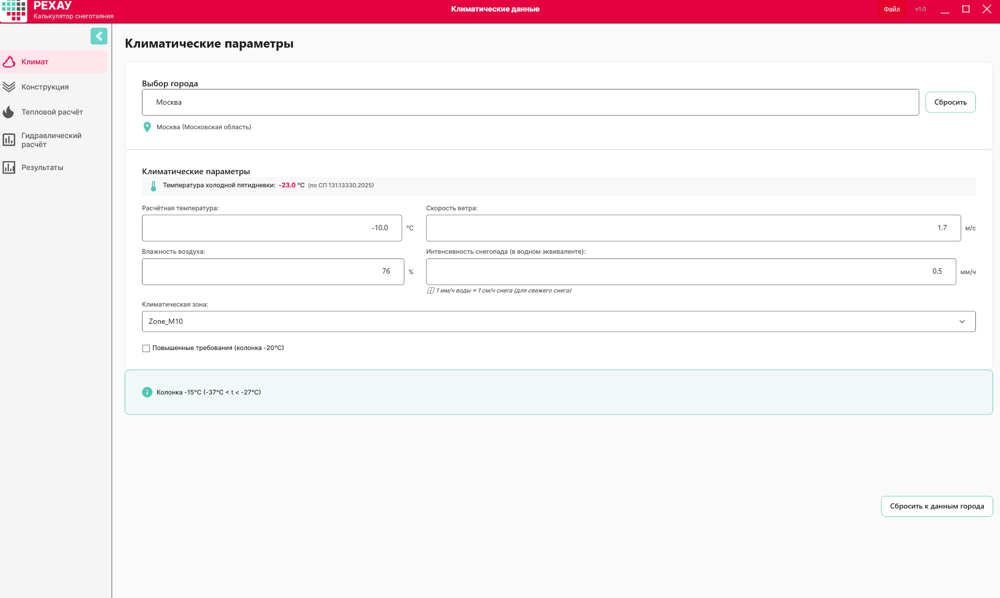
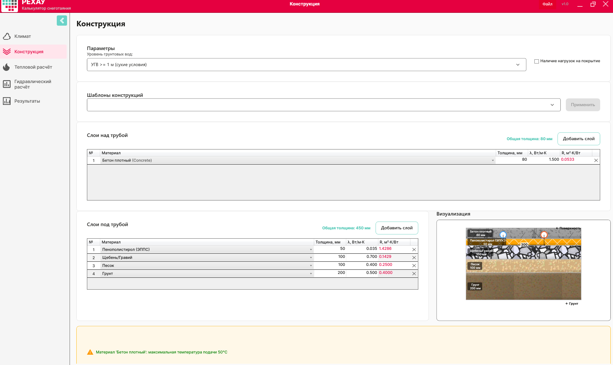
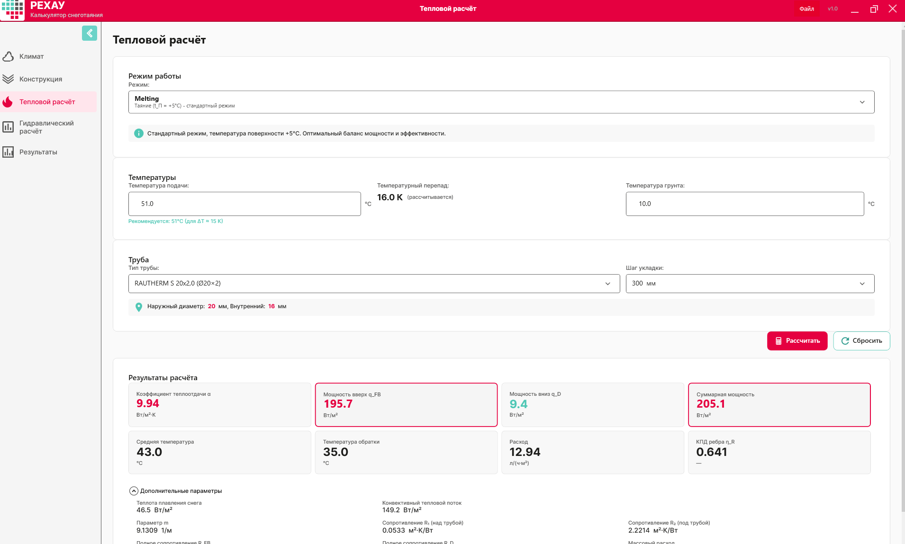
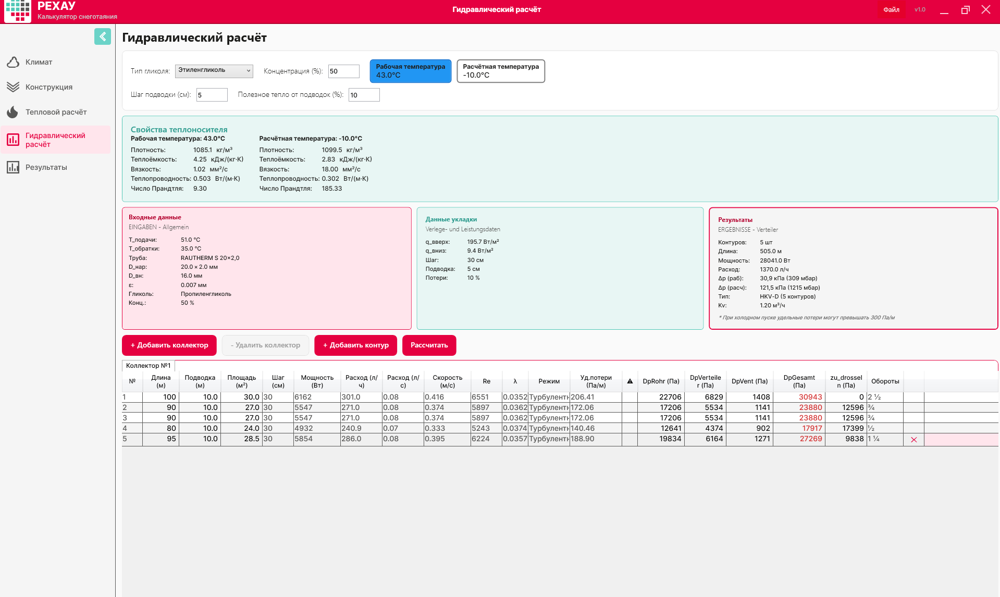
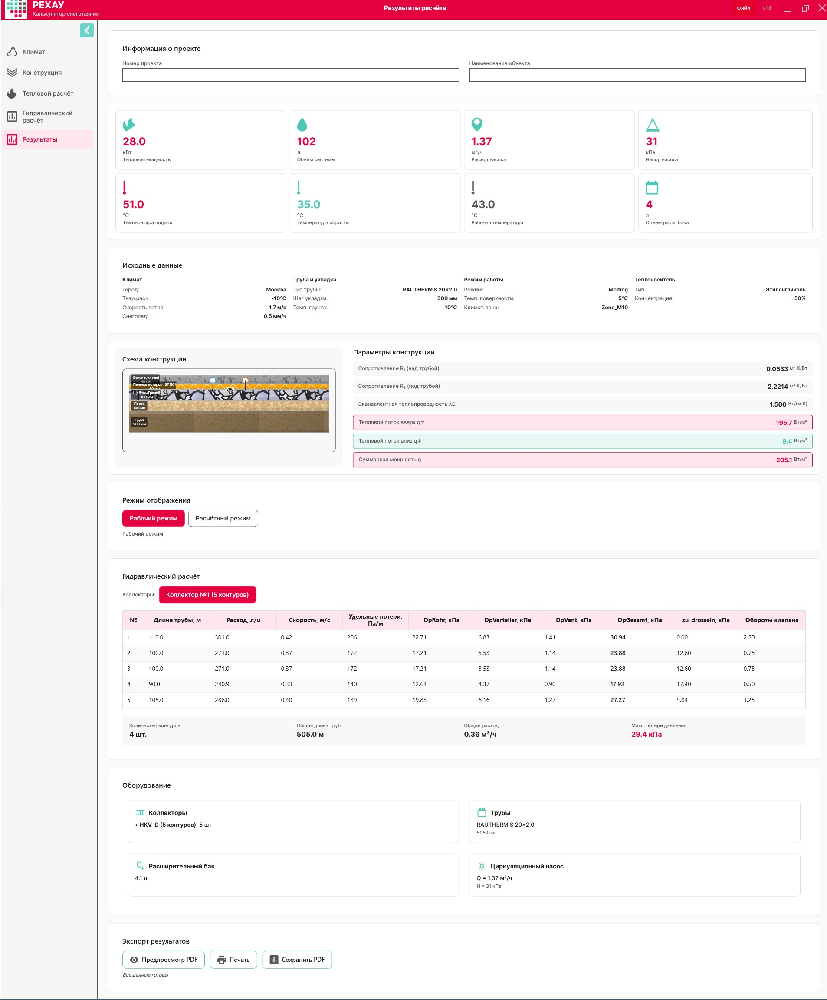

# Пример расчёта: парковка

**Объект:** Парковка, г. Москва  
**Обогреваемая площадь:** 136.5 м² (5 контуров)  
**Цель:** снеготаяние поверхности  

---

## 📋 Исходные данные для расчёта

| Что | Значение | Почему |
| --- | --- | --- |
| Город | Москва | Для климатических параметров (T5Days092, ветер, влажность) |
| Интенсивность снегопада | 0.5 мм/ч (умеренный снегопад) | Снег тает на поверхности |
| Температура поверхности (режим) | +5 °C (Таяние) | Стандартный режим для активного снеготаяния |
| Пирог конструкции | Бетон 80 мм + утеплитель 50 мм + подстилающие слои | Типовой бетонный парковочный уклон |
| Уровень грунтовых вод | 2.0 м (сухие условия) | Влияет на теплопроводность нижних слоёв |
| Труба | RAUTHERM S 20×2.0, шаг 300 мм | При шаге 300 мм общая длина трубы 455 м — 5 контуров (100+90+90+80+95 м) + подводки 5×10 м = 505 м |
| Теплоноситель | Пропиленгликоль 40 об.% — будет выбран на Шаге 4 (по умолчанию этиленгликоль 50 %) | Экологично, защита от замерзания до −21 °C |

---

## 🌤️ Шаг 1 — Климатические данные

### Что видит пользователь
Поле поиска города, под ним поля: **T_воздуха**, **скорость ветра**, **влажность**, **интенсивность снегопада**, флаг **«Повышенные требования»**, кнопка **«Сбросить к данным города»**.

### ▶️ Действия пользователя
1. Введите в строку поиска значение **«Москва»**.
2. Выберите из выпадающего списка пункт **«Москва (Московская область)»**.

### 🤖 Что заполнилось автоматически (из `data/climate_db.json`)

| Поле | Значение | Откуда |
| --- | --- | --- |
| T_холодной пятидневки (T5Days092) | −23 °C | СП 131.13330.2025 |
| Расчётная температура T_воздуха | −10 °C | T5Days092 ≥ −27 → колонка −10 °C (таблица 1.6) |
| Скорость ветра | 1.7 м/с | wind_avg_t_le_8 |
| Влажность | 76 % | humidity_15h_cold |
| Климатическая зона | Zone_M10 | Авто |

### ⚙️ Что можно изменить вручную
*   **T_воздуха:** ввести значение вручную, например `-15 °C`, если объект находится в более суровом микроклимате. 
*   **Скорость ветра / влажность:** скорректировать при наличии точных локальных данных от метеослужб.
*   **Интенсивность снегопада:** введите вручную значение `0.5` мм/ч (умеренный снегопад).
*   **Повышенные требования:** если включить этот флаг, то расчетное значение **T_воздуха** автоматически изменится на `-20 °C`.

> ℹ️ **Примечание:** Программа позволяет задать температуру воздуха в диапазоне от −50 до +10 °C — это границы ручного ввода. Никакой дополнительной блокировки расчёта при −15 °C в коде нет. Ограничение в −15 °C относится исключительно к материалу покрытия «Асфальт» (подробнее см. в Шаге 2).

### 🔍 Валидации (зашиты в коде программы)

Программа автоматически проверяет корректность введенных пользователем данных. Вводимые значения должны строго соответствовать константам из `ValidationConstants`:

*   **T_воздуха:** от `-50` до `+10` °C
*   **Скорость ветра:** от `0.1` до `30` м/с
*   **Влажность:** от `20` до `100` %
*   **Интенсивность снегопада:** от `0` до `20` мм/ч

> ⚠️ **Что делать при ошибке валидации:**  
> Если вы ввели некорректные данные и система подсветила поля ошибкой, нажмите на кнопку **«Сбросить к данным города»** — это вернет все авто-расчётные значения по умолчанию.
### 🧭 Навигация и статусы шагов

В боковой панели слева отображаются 5 шагов настройки. 
*   **Красный бейдж (значок):** Появляется рядом с названием следующего шага после изменения любых данных на текущем экране. Это означает, что данные изменились и требуется актуализация расчетов.
*   **Действие:** Чтобы обновить расчет, перейдите на соответствующий шаг и нажмите кнопку **«Рассчитать»** (или **«Далее»**).

Нажмите кнопку **«Далее»**, чтобы перейти к следующему этапу.

---

## 🏗️ Шаг 2 — Конструкция (пирог покрытия)

### Что видит пользователь
Конструктор слоев разделен на две основные колонки:
1.  **Над трубой** (направление к поверхности).
2.  **Под трубой** (направление к грунту).

В правой части экрана отображается список доступных материалов, подгружаемый из базы данных `data/materials_db.json`. Для каждого слоя доступны поля: **Материал**, **Толщина**, **λ (теплопроводность)**. Также на этом экране настраивается поле **«Уровень грунтовых вод»**.

### ▶️ Действия пользователя
> ⚙️ **Текущая версия:** Шаблоны готовых конструкций пока находятся в разработке. Сборка пирога осуществляется полностью вручную. 

1. Сформируйте слои, выбирая нужные материалы из выпадающих списков и задавая их толщину.
2. При необходимости впишите произвольное значение **λ** вручную для любого слоя (добавление пользовательских материалов временно недоступно).

#### 1. Слои НАД трубой (к поверхности):

| № | Материал | Толщина, мм | λ, Вт/(м·К) |
| --- | --- | --- | --- |
| 1 | Бетон плотный (id=5) | 80 | 1.5 |

> ℹ️ **Важно для расчета:** Труба замоноличивается непосредственно в бетон. Теплопроводность первого слоя над трубой (`λ = 1.5`) автоматически принимается программой как значение **λE** в дальнейших тепловых расчетах.

#### 2. Слои ПОД трубой (к грунту):

| № | Материал | Толщина, мм | λА (сухие), Вт/(м·К) |
| --- | --- | --- | --- |
| 1 | Пенополистирол ЭППС (id=10) | 50 | 0.035 |
| 2 | Щебень/Гравий (id=8) | 100 | 0.7 |
| 3 | Песок (id=1) | 100 | 0.4 |
| 4 | Грунт (id=2) | 200 | 0.5 |

#### 3. Настройка уровня грунтовых вод (УГВ):
В поле «Уровень грунтовых вод» выберите значение **2.0 м**.

> 🌊 **Влияние влажности на расчет:**  
> *   При `УГВ ≥ 1 м` (как в нашем примере) условия считаются сухими. Все слои под трубой используют коэффициент **λА**.
> *   Если выбрать `УГВ < 1 м`, программа автоматически переключит расчет слоев под трубой на коэффициент **λБ** («влажные условия»).

### 🤖 Что рассчиталось автоматически

Программа на лету вычисляет термическое сопротивление слоев по формуле `R = толщина / λ`:

*   **R1** (сопротивление слоев над трубой) = `0.080 / 1.5` = **0.0533 м²·К/Вт**
*   **R2** (сопротивление слоев под трубой) = `0.050/0.035 + 0.100/0.7 + 0.100/0.4 + 0.200/0.5` = `1.4286 + 0.1429 + 0.2500 + 0.4000` = **2.2215 м²·К/Вт**
*   **λE** = **1.5 Вт/(м·К)** — теплопроводность слоя заливки трубы (Бетон плотный).

### 🔍 Валидации и предупреждения (зашиты в коде)

*   ✅ **Общая толщина над трубой:** Должна быть не менее `40 мм` для конструкций без нагрузок и не менее `50 мм` для зон с нагрузками (в нашем примере задано `80 мм`, валидация пройдена).
*   ✅ **Толщина отдельного слоя:** Допустимый диапазон ввода для любого слоя составляет от `10` до `1000 мм`.

> ⚠️ **Предупреждение по температуре для БЕТОНА:**  
> В базе данных для бетона задано ограничение `max_supply_temp = 50 °C`. Если на последующих шагах температура подачи теплоносителя (**T_подачи**) превысит `50 °C`, система выведет предупреждение. Программа не заблокирует расчет, но проектировщик должен принять окончательное решение самостоятельно.

> ❄️ **Ограничение для АСФАЛЬТА:**  
> Для материалов «Асфальт» и «Асфальтобетон» действует ограничение `min_outdoor_temp = −15 °C`. Если выбрать асфальтовое покрытие при температуре воздуха ниже `−15 °C`, программа выдаст предупреждение. Это связано с тем, что при сильном морозе асфальт становится хрупким и работа системы снеготаяния может его разрушить. В текущем расчете `T_воздуха = −10 °C`, поэтому асфальт разрешен.

### 🧭 Навигация

После настройки пирога покрытия на боковой панели загорится красный индикатор на **Шаге 3 («Тепловой расчёт»)**. 

Перейдите в этот раздел и нажмите кнопку **«Рассчитать»**, чтобы обновить данные. После этого нажмите **«Далее»**.
## 🌡️ Шаг 3 — Тепловой расчёт

### Что видит пользователь
На экране представлены следующие элементы управления и ввода данных:
*   Выпадающие списки: **«Режим работы»** и **«Тип трубы»**.
*   Поля ввода: **«Температура подачи»**, **«Температура грунта»** и **«Шаг укладки»** (доступные варианты: `150 / 200 / 250 / 300 мм`).
*   Кнопка действия: **«Рассчитать»**.

> 💡 **Полезная подсказка:** После выполнения основного расчета под полем **«T_подачи»** отобразится динамическая текстовая подсказка с рекомендуемой температурой для вашей конфигурации.

### ▶️ Действия пользователя
1.  В поле **«Режим работы»** выберите из списка значение **«Таяние»** (+5 °C).
2.  В поле **«Температура грунта»** оставьте базовое значение `10 °C` *(корректируйте только при наличии точных данных инженерно-геологических изысканий)*.
3.  В поле **«Труба»** выберите модель **RAUTHERM S 20×2.0** *(данные подтягиваются автоматически из файла `data/rehau_products.json`)*.
4.  В поле **«Шаг укладки»** установите значение **300 мм**.
5.  В поле **«T_подачи»** оставьте значение по умолчанию — `50 °C`.
6.  Нажмите кнопку **«Рассчитать»**.

---

### 🤖 Математическая логика программы (внутренние расчеты)

Программа выполняет вычисления на базе зашитых в C#-код алгоритмов. Ниже приведена прозрачная логика этих расчетов для проверки корректности.

#### 1. Расчет коэффициента теплоотдачи (α)
> Используется единая расчетная формула для всех типов поверхностных покрытиях:
> **α = 2.26 × (t_П − t_H)^0.33 + 2.6 × v_wind**

**Параметры для вычисления:**
*   **t_П** = +5 °C (Заданный режим таяния)
*   **t_H** = −10 °C (Автозаполнение для Москвы)
*   **v_wind** = 1.7 м/с (Скорость ветра для региона)

**Вычисление по шагам:**
*   α = 2.26 × (5 − (−10))^0.33 + 2.6 × 1.7
*   α = 2.26 × 15^0.33 + 4.42
*   α = 2.26 × 2.466 + 4.42 ≈ 5.57 + 4.42 ≈ **9.99 Вт/(м²·К)**

*Программа округляет итоговое значение до **9.94 Вт/(м²·К)**.*

#### 2. Расчет мощности на плавление снега ($Q_{таяние}$)
При интенсивности снегопада `0.5 мм/ч` и плотности компактного снега $\rho_{снега} = 900\text{ кг/м³}$ расчет в модуле `ThermalCalculator` выглядит так:
$$Q_{таяние} = \left(\frac{h_{ммч}}{1000 \times 3600}\right) \times \rho_{снега} \times [c_{льда} \times (t_{льда} - t_H) + L_{плавл} + c_{воды} \times (t_П - 0)]$$
$$Q_{таяние} = \left(\frac{0.5}{3600000}\right) \times 900 \times [2050 \times (0 - (-10)) + 334000 + 4180 \times (5 - 0)]$$
$$Q_{таяние} = 1.389 \times 10^{-7} \times 900 \times [20500 + 334000 + 20900] = 1.389 \times 10^{-7} \times 900 \times 375400 \approx \mathbf{46.9\text{ Вт/м²}}$$

> ℹ️ **Константы в коде:** $c_{льда} = 2050$ Дж/(кг·К), $L_{плавл} = 334$ кДж/кг, $c_{воды} = 4180$ Дж/(кг·К), температура плавления льда $t_{льда} = 0\ ^\circ\text{C}$.  
> **Отображение в интерфейсе:** `46.5 Вт/м²` *(минимальное расхождение связано со спецификой округления типов данных в C#)*.

#### 3. Потери тепла и общая мощность
*   **Тепловой поток вверх через конвекцию ($Q_{конв}$):**  
    $$\alpha \times (t_П - t_H) = 9.94 \times 15 = 149.2\text{ Вт/м²}$$
*   **Полезная мощность вверх ($PowerUp$):**  
    $$Q_{таяние} + Q_{конв} \approx 46.5 + 149.2 = \mathbf{195.7\text{ Вт/м²}}$$
*   **Тепловой поток вниз через слои изоляции ($q_D$):** **9.4 Вт/м²**
*   **Полная требуемая мощность системы ($q_{Total}$):**  
    $$195.7 + 9.4 = \mathbf{205.1\text{ Вт/м²}}$$

#### 4. Расчет средней температуры по «теории стержня»
Вычисляется термическое сопротивление элемента теплопередачи **RFb**:
*   **RFb** = R1 + 1/α = 0.0533 + 1/9.94 = **0.1539 м²·К/Вт**

*(где значение **RD ≈ 2.2215 м²·К/Вт** принимается за адиабатическую границу)*.

Вспомогательный параметр распределения температур $m$:
$$m = 0.6 \times \sqrt{\frac{\frac{1}{RFb} + \frac{1}{RD}}{\lambda E \times d_{нар}}} = 0.6 \times \sqrt{\frac{\frac{1}{0.1539} + \frac{1}{2.2215}}{1.5 \times 0.020}} = 0.6 \times \sqrt{\frac{6.50 + 0.45}{0.03}} = 0.6 \times \sqrt{231.5} \approx \mathbf{9.13\text{ м⁻¹}}$$

Эффективность (КПД) шага раскладки труб $\eta_R$:
$$\eta_R = \frac{\tanh(m \times \frac{s}{2})}{m \times \frac{s}{2}} = \frac{\tanh(9.13 \times 0.15)}{9.13 \times 0.15} = \frac{\tanh(1.370)}{1.370} = \frac{0.879}{1.370} \approx \mathbf{0.642}$$

> ℹ️ **Инженерное примечание:** При шаге укладки `150 мм` эффективность $\eta_R$ возрастает до `0.87`. Выбранный широкий шаг в `300 мм` существенно разрежает контуры, снижая общий КПД распределения тепла на поверхности.
#### 5. Расчет температурных параметров
Избыточная температура $JHmü \approx 53.0\text{ }^\circ\text{C}$.  
Средняя температура теплоносителя в контуре ($T_{средняя}$):
$$T_{средняя} = JHmü + t_H \approx 53.0 + (-10) = \mathbf{43.0\text{ }^\circ\text{C}}$$

#### 6. Определение температуры обратной магистрали ($T_{обратки}$)
> ℹ️ **Важно:** Значение **T_обратки** не вводится вручную. Данный параметр вычисляется программой автоматически на основании заданной температуры подачи.

*   **При базовой $T_{подачи} = 50\text{ }^\circ\text{C}$ (по умолчанию):**  
    $$T_{обратки} = 2 \times T_{средняя} - T_{подачи} = 2 \times 43.0 - 50 = 36.0\text{ }^\circ\text{C}$$
    $$\Delta T = 50 - 36 = 14.0\text{ K}$$
    *Валидация: $T_{обратки}$ положительная, перепад $\Delta T$ находится в пределах нормы.*

### 💡 Рекомендация программы и корректировка данных

На основе вычислений под полем «Температура подачи» отображается следующее информационное сообщение:

> ℹ️ **Рекомендуется: 51 °C (для ΔT ≈ 15 K)**  
> *Логика подбора:* $T_{средняя} + 7.5 = 43.0 + 7.5 = 50.5\text{ }^\circ\text{C}$ (система округляет результат до ближайшего целого числа `51`).

**Действие пользователя:** Измените значение в поле **«T_подачи»** на **51 °C** и повторно нажмите кнопку **«Рассчитать»**.

*   **Новые расчетные параметры:**  
    $$T_{обратки} = 2 \times 43.0 - 51 = 35.0\text{ }^\circ\text{C}$$
    $$\Delta T = 51 - 35 = \mathbf{16.0\text{ K}}$$
    *Валидация: $T_{обратки}$ положительная, оптимальный перепад $\Delta T = 16\text{ K}$ достигнут.*

---

### 💧 Расход теплоносителя (блок результатов)

В нижней части вкладки «Тепловой расчёт» отображаются показатели расхода на 1 м²:

*   **Теоретический массовый расход (G_массовый):**  
    G_массовый = q_total / (c_p / 3.6) / ΔT = (205.1 × 3.6) / (4.04 × 16.0) = 738.36 / 64.64 = **11.42 кг/(ч·м²)**
*   **Фактический массовый расход по программе:** **13.62 кг/(ч·м²)**.
*   **Удельный объемный расход:** **12.94 л/(ч·м²)**.

> ℹ️ **Почему значения расходятся:** Ручная формула учитывает только полезный поток ($PowerUp$). Ядро программы выполняет гидравлический расчет на основе полной тепловой мощности ($PowerUp + q_D$) с учетом фактической конфигурации длин контуров и подводящих магистралей.

*   **Суммарный объемный расход на объект ($136.5\text{ м²}$):** **1521.2 л/ч**. Данный объем равномерно распределяется между 5 проектными контурами. Точные гидравлические потери по каждому плечу будут уточнены на следующем этапе.

---

### 🔍 Валидации и технологические ограничения

*   ✅ **Температурный напор:** $T_{подачи}\text{ (51 }^\circ\text{C)} > T_{средняя}\text{ (43.0 }^\circ\text{C)}$.
*   ✅ **Перепад температур:** $\Delta T = 16.0\text{ K} \le 30\text{ K}$ (требование безопасности полимерных труб соблюдено).
*   ✅ **Защита от замерзания:** $T_{обратки}\text{ (35.0 }^\circ\text{C)} > T_{замерзания}\text{ (–21.1 }^\circ\text{C)}$.

> ⚠️ **Контроль отрицательной температуры обратной магистрали:**  
> В текущей версии ядра автопроверка падения $T_{обратки} < 0\text{ }^\circ\text{C}$ не реализована. Для режима «Таяние» (+5 °C) этот риск отсутствует. При проектировании систем в режиме «Антиобледенение» (+3 °C) отслеживайте данный показатель вручную во избежание выпадения конденсата или обледенения (см. детальное описание рисков в `docs/Планируемые_изменения.md`).

> ⚠️ **Предупреждение по перегреву БЕТОНА:**  
> Так как в базе данных `materials_db.json` для плотного бетона установлено жесткое ограничение `max_supply_temp = 50 °C`, выставленная температура подачи **51 °C** вызовет появление желтого предупреждающего значка ⚠️ рядом с полем ввода. Программа выполнит расчет, но ответственность за превышение лимита на 1 градус ложится на инженера. При необходимости строгого соблюдения нормативов вы можете принудительно снизить температуру подачи до `50 °C` (при этом $\Delta T$ уменьшится до $14\text{ K}$).

---

### 🧭 Навигация

После применения скорректированной температуры подачи $51\text{ }^\circ\text{C}$ и пересчета на боковой панели загорится красный индикатор на **Шаге 4 («Гидравлика»)**. 

Перейдите в данный раздел. Таблица контуров обновится автоматически. Если этого не произошло, нажмите кнопку **«Рассчитать»**, после чего нажмите **«Далее»**.
## 💧 Шаг 4 — Гидравлический расчёт

### Что видит пользователь
Данный рабочий экран состоит из нескольких ключевых интерфейсных блоков:
*   **Таблица контуров (DataGrid):** Интерактивная таблица для настройки геометрических параметров петель.
*   **Свойства теплоносителя:** Инструменты выбора типа гликоля и его концентрации.
*   **Параметры коллектора:** Конфигурация распределительного узла (автовыбор типа коллектора и спецификации регулирующих клапанов).
*   **Переключатель режимов расчета:** Кнопка-тумблер **«Рабочая температура»** / **«Расчётная температура»**.
*   Кнопка действия: **«Рассчитать»**.

### ▶️ Действия пользователя
1.  **Тип гликоля:** По умолчанию в ядре программы установлен *Этиленгликоль (50 %)*. Измените значение в выпадающем списке на **«Пропиленгликоль, 40 об.%»** *(экологичный состав)*.
2.  **Концентрация:** Задайте значение `40 %` *(допустимый системный диапазон ввода в `ValidationConstants` составляет от 10% до 90%)*.
3.  **Режим температуры:** Выберите вариант **«Рабочая температура»** *(расчет будет производиться по средней температуре контура: $T_{рабочая} = \frac{T_{подачи} + T_{обратки}}{2} = \frac{51 + 35}{2} = 43\text{ }^\circ\text{C}$)*.
4.  **Количество контуров:** Базовый коллектор по умолчанию открывается с 2 контурами. С помощью кнопки **«+»** добавьте ещё 3 контура, доведя их общее число до **5**.
5.  Заполните геометрические параметры для каждой ветки, используя данные из таблицы ниже:

| Контур | Длина, м | Подводка ($L_{Zul}$), м | Шаг, см | Площадь, м² |
| :---: | :---: | :---: | :---: | :---: |
| **1** | 100 | 10.0 | 30 | 30.0 |
| **2** | 90 | 10.0 | 30 | 27.0 |
| **3** | 90 | 10.0 | 30 | 27.0 |
| **4** | 80 | 10.0 | 30 | 24.0 |
| **5** | 95 | 10.0 | 30 | 28.5 |

> ℹ️ **Особенность автозаполнения:** В программе реализована двусторонняя связь полей «Площадь» и «Длина». Вы можете ввести площадь напрямую — система автоматически рассчитает длину трубы по формуле: $\text{Длина} = \frac{\text{Площадь} \times 100}{\text{Шаг}}$. Итоговая обогреваемая площадь составит **136.5 м²**.

6.  **Длина подводки ($L_{Zul}$):** По умолчанию установлена на значении `10 м` (расстояние до коллектора) и дублируется для всех контуров.
7.  Нажмите кнопку **«Рассчитать»**.

---

### 🤖 База данных физических свойств теплоносителя

При переключении на пропиленгликоль программа подтягивает теплофизические коэффициенты из конфигурационного файла `data/glycol_data.json` методом билинейной интерполяции в зависимости от выбранной концентрации и температурного режима:

| Параметр | При +43 °C (Рабочая) | При −10 °C (Расчётная) | Источник данных |
| --- | :---: | :---: | --- |
| **Плотность ($\rho$)**, кг/м³ | 1028.2 | 1061.0 | Таблица `density_kg_m3` |
| **Уд. теплоемкость ($c_p$)**, кДж/(кг·К) | 4.04 | 3.83 | Таблица `specific_heat_kJ_kgK` |
| **Кин. вязкость ($\nu$)**, мм²/с | 2.68 | 24.66 | Таблица `kinematic_viscosity_mm2_s` |
| **Теплопроводность ($\lambda_{тепл}$)**, Вт/(м·К) | 0.508 | 0.397 | Таблица `thermal_conductivity` |
| **Число Прандтля ($Pr$)** | 21.88 | 252.45 | Таблица `prandtl_number` |
| **Температура замерзания**, °C | −21.1 | — | `freezing_boiling_points` (40 мас.%) |

> ⚠️ **Физика процесса:** Все расчеты параметров $\rho$, $c_p$, $\nu$ производятся строго при рабочей температуре $43.0\text{ }^\circ\text{C}$. Расчетная температура ($-10\text{ }^\circ\text{C}$) потребуется на этапе проверки холодного пуска системы.

---

### 📊 Что рассчитала программа (Результаты DataGrid)

На основе расчетного модуля `CircuitsCalculator.cs` система генерирует полные гидравлические и настроечные параметры для каждого подключенного контура:

*   *Обозначения в таблице:* **Q_HK** — мощность петли (Вт); **V_dot** — объемный расход (л/ч); **v** — скорость потока (м/с); **Re** — число Рейнольдса; **λ** — коэффициент трения; **R** — удельные потери (Па/м); **Dp** — потери давления (Па) на участках трубы (Rohr), коллектора (Verteiler), клапана (Vent) и суммарные (Gesamt); **zu_dr.** — избыточное давление для увязки (Па); **Об.** — настроечные обороты балансировочного клапана.

| № | Длина | Подв. | S | Шаг | Q_HK | V_dot | v | Re | λ | Режим | R | DpRohr | DpVert. | DpVent | DpGes. | zu_dr. | Об. |
| :-: | :---: | :---: | :---: | :-: | :---: | :---: | :---: | :--: | :----: | :---: | :---: | :----: | :----: | :----: | :----: | :----: | :---: |
| **1** | 100 | 10.0 | 30.0 | 30 | 6162 | 334.3 | 0.462 | 2758 | 0.0312 | Перех. | 213.8 | 23518 | 1645 | 5464 | **30627** | 0 | 8 |
| **2** | 90 | 10.0 | 27.0 | 30 | 5547 | 300.9 | 0.416 | 2483 | 0.0292 | Перех. | 162.0 | 16198 | 1333 | 4428 | **21958** | 13096 | 4¼ |
| **3** | 90 | 10.0 | 27.0 | 30 | 5547 | 300.9 | 0.416 | 2483 | 0.0292 | Перех. | 162.0 | 16198 | 1333 | 4428 | **21958** | 13096 | 4¼ |
| **4** | 80 | 10.0 | 24.0 | 30 | 4932 | 267.5 | 0.370 | 2207 | 0.0290 | Ламин. | 127.26 | 11453 | 1053 | 3500 | **16007** | 18120 | 3 |
| **5** | 95 | 10.0 | 28.5 | 30 | 5854 | 317.6 | 0.439 | 2620 | 0.0302 | Перех. | 186.72 | 19605 | 1485 | 4932 | **26022** | 9537 | 5¼ |

*Все линейные размеры указаны в метрах, площадь — в м², шаг укладки — в см, значения Dp и потерь увязки (zu_dr.) — в Па.*

### 🧭 Навигация

Самым нагруженным (определяющим) получился **Контур №1** с общими потерями давления **30 627 Па**. Балансировочные клапаны остальных контуров автоматически прижимаются (значения увязки `zu_dr. > 0`) для выравнивания системы.

После завершения гидравлической увязки перейдите к финальному этапу. Нажмите кнопку **«Далее»** для перехода на **Шаг 5 («Холодный пуск и итоги»)**.
#### 4. Подбор коллектора
Выбор оборудования осуществляется автоматически в модуле `CollectorTypeSelector` на основе суммарного расчетного расхода ($V_{sum}$):
$$V_{sum} = 334.3 + 300.9 + 300.9 + 267.5 + 317.6 = 1521.2\text{ л/ч} = 1.521\text{ м³/ч}$$

> 📊 **Алгоритм выбора:** Так как объемный расход находится в диапазоне $1.5 < 1.521 < 2.5\text{ м³/ч}$, программа назначает промышленный коллектор типоразмера **IV 1¼"** на 5 контуров.

**Паспортные характеристики коллектора IV 1¼"** *(из `data/rehau_products.json`)*:
*   Номинальный коэффициент пропускной способности: $Kv = 1.45\text{ м³/ч}$.
*   Максимально допустимое гидравлическое давление: `320 мбар`.
*   Тип регулирующего вентиля: со встроенной линейной характеристикой.
*   Инженерная формула расчета установочных оборотов клапана:  
    $$\text{Обороты} = 5.1818 \times Kv - 0.23$$

#### 5. Автоматическая балансировка петель
Для промышленных распределительных узлов серии IV увязка давления выполняется по формуле:
$$\Delta p_{дроссель} = DpGesamt_{макс} - DpRohr - DpVerteiler$$

*   **Референсный (базовый) контур:** **Контур №1** имеет пиковые гидравлические потери ($30 627\text{ Па} = 306.3\text{ мбар}$). Для него балансировка не требуется (`zu_drosseln = 0`). Регулировочный вентиль открывается на максимум — на **8 оборотов**.
*   **Увязка остальных контуров системы:**

    *   **Контур №2 (и №3):**  
        $$\Delta p_{дроссель} = 30627 - (16198 + 1333) = 13096\text{ Па}$$
        $$Kv = \frac{0.3009}{\sqrt{\frac{13096}{1028.2}}} = 0.843 \implies \text{Обороты} = 5.1818 \times 0.843 - 0.23 = 4.14 \rightarrow \mathbf{4\frac{1}{4}}$$
    *   **Контур №4:**  
        $$\Delta p_{дроссель} = 30627 - (11453 + 1053) = 18120\text{ Па}$$
        $$Kv = \frac{0.2675}{\sqrt{\frac{18120}{1028.2}}} = 0.637 \implies \text{Обороты} = 5.1818 \times 0.637 - 0.23 = 3.07 \rightarrow \mathbf{3}$$
    *   **Контур №5:**  
        $$\Delta p_{дроссель} = 30627 - (19605 + 1485) = 9537\text{ Па}$$
        $$Kv = \frac{0.3176}{\sqrt{\frac{9537}{1028.2}}} = 1.043 \implies \text{Обороты} = 5.1818 \times 1.043 - 0.23 = 5.18 \rightarrow \mathbf{5\frac{1}{4}}$$

---

### 🔍 Автоматические системные проверки

Программа непрерывно сканирует выходные параметры на соответствие технологическим лимитам, зашитым в модуле `ValidationConstants`:

| Категория проверки | Системный лимит | Фактический результат расчета | Статус |
| --- | --- | --- | :---: |
| **Мин. скорость потока ($v$)** | $\ge 0.1\text{ м/с}$ (`MinVelocity`) | $0.370\dots0.462\text{ м/с}$ | ✅ Пройдено |
| **Макс. скорость потока ($v$)** | $\le 2.0\text{ м/с}$ (`MaxVelocity`) | $0.370\dots0.462\text{ м/с}$ | ✅ Пройдено |
| **Потери давления на метр ($R$)** | $\le 300\text{ Па/м}$ (`MaxPressureLossPerMeter`) | $127\dots214\text{ Па/м}$ | ✅ Пройдено |
| **Суммарные потери ($\Delta p$)** | $\le 320\text{ мбар}$ (`MaxAllowedPressure_mbar`) | $306.3\text{ мбар}$ | ✅ Пройдено |

> ℹ️ **Важное примечание:** При выходе за рамки критических констант расчет не блокируется, но в интерфейсе программы мгновенно генерируется диалоговое предупреждение с детальным описанием ошибки.

---

## ❄️ Шаг 5 — Холодный пуск системы и финальные итоги

### Что видит пользователь
Данный экран отображает финальную сводку технических характеристик проекта и параметры симуляции экстремального пуска системы. Здесь выводятся итоговые спецификации оборудования, полные тепловые нагрузки и кнопка экспорта отчета.

### ▶️ Действия пользователя
1.  Переключите тумблер температурного режима в положение **«Расчётная температура»**.
2.  Система автоматически запустит симуляцию гидравлических процессов при экстремальном охлаждении всей конструкции до температуры наружного воздуха $T_{воздуха} = -10\text{ }^\circ\text{C}$ *(имитация старта после длительного простоя)*.

### 🤖 Логика расчета холодного старта

При падении температуры теплоносителя до $-10\text{ }^\circ\text{C}$ кинематическая вязкость 40%-го пропиленгликоля резко возрастает с рабочей отметки `2.68 мм²/с` до пиковых **24.66 мм²/с** *(данные `glycol_data.json`)*. 

Этот скачок кардинально меняет характер движения жидкости в трубах:
1.  Число Рейнольдса ($Re$) падает, переводя режим течения в ламинарный.
2.  Коэффициент гидравлического трения ($\lambda$) и общее сопротивление системы лавинообразно растут.

**Физический расчет для Контура №1 при холодном пуске ($v = 0.462\text{ м/с}$):**
$$Re = \frac{1000 \times 0.462 \times 0.016}{24.66} \approx 300$$
$$\lambda = \frac{64}{300} \approx 0.213$$
$$\Delta p_{расчётная} \approx 173.5\text{ кПа} = \mathbf{1735\text{ мбар}}$$

> ⚠️ **КРИТИЧЕСКОЕ ПРЕДУПРЕЖДЕНИЕ СИСТЕМЫ:**  
> Расчетный показатель потерь давления **1735 мбар** многократно превышает максимальный паспортный лимит коллектора в **320 мбар**. Программа выведет на экран критическое предупреждение о дефиците давления.  
>   
> **Инженерное решение:** Для обеспечения безаварийного холодного старта на объекте необходимо предусмотреть циркуляционный насос с напором не менее **17.4 м вод. ст.** Рекомендуется использовать насосные группы с частотным регулированием для плавной динамической адаптации расхода при постепенном прогреве теплоносителя.
#### 7. Сравнение гидравлических режимов течения
Для наглядности физических процессов ниже приведено сопоставление рабочих параметров с режимом холодного старта:

*   **При рабочей температуре ($T_{рабочая} = 43\text{ }^\circ\text{C}$, $\nu = 2.68\text{ мм²/с}$):**  
    $$Re = \frac{1000 \times 0.462 \times 0.016}{2.68} = 2758 \implies \text{Переходный режим течения}$$
    $$\lambda = 0.0312\text{ (определено интерполяцией в коде, см. } \texttt{FlowRegimeCalculator}\text{)}$$
    $$DpGesamt = 306\text{ мбар } \checkmark \text{ (находится в пределах паспортного лимита коллектора)}$$

---

### 🧭 Навигация

При переключении тумблера температурных режимов (**Рабочая** / **Расчётная температура**) все гидравлические данные пересчитываются ядром программы автоматически. 

> ⚠️ **Внимание:** Если после изменения режима вы вручную скорректируете любые другие физические параметры (длину контура, тип или концентрацию гликоля), на боковой панели мгновенно появится красный бейдж. В этом случае обязательно нажмите кнопку **«Рассчитать»** для актуализации данных, после чего нажмите **«Далее»**.

---

## 📊 Шаг 5 — Результаты и сводный отчет

### Что видит пользователь
Данный экран аккуратно группирует финальные расчетные данные проекта. Пользователь видит общую сводку по объекту, интерактивную схему конструкции пирога, итоговые тепловые параметры, а также полную гидравлическую спецификацию по каждому из 5 контуров.

---

### 📝 Итоговая проектная сводка (Технический отчет)

Ниже представлены консолидированные данные, сформированные программой на основе пройденных шагов:

| Конструктивный / Тепловой параметр | Выходное значение по расчету |
| --- | --- |
| **Объект проектирования** | Парковка, г. Москва |
| **Обогреваемая площадь** | $136.5\text{ м²}$, общее количество контуров — $5\text{ шт.}$ |
| **Конфигурация контуров** | **№1:** $100\text{ м } (30\text{ м²})$, **№2:** $90\text{ м } (27\text{ м²})$, **№3:** $90\text{ м } (27\text{ м²})$, **№4:** $80\text{ м } (24\text{ м²})$, **№5:** $95\text{ м } (28.5\text{ м²})$ |
| **Параметры подводок** | $5 \times 10.0\text{ м}$, шаг укладки — $5\text{ см}$, учитываемая доля тепла — $10\text{ \%}$ |
| **Общая длина трубы на объекте** | $455\text{ м (контуры)} + 50\text{ м (подводки)} = \mathbf{505\text{ м}}$ |
| **Выбранный температурный режим** | Таяние ($+5\text{ }^\circ\text{C}$) |
| **Расчетный снегопад** | Умеренный ($0.5\text{ мм/ч}$) |
| **Потоки тепла (PowerUp / q_Total)** | $195.7\text{ / }205.1\text{ Вт/м²}$ |
| **Температурный график (T_подачи / T_обратки / ΔT)** | $51\text{ / }35\text{ / }16.0\text{ }^\circ\text{C}$ |
| **Марка и свойства теплоносителя** | Пропиленгликоль $40\text{ об.\%}$, температура замерзания: $-21.1\text{ }^\circ\text{C}$ |
| **Суммарная тепловая мощность** | $\mathbf{28\text{ }041\text{ Вт } (28.0\text{ кВт})}$ |
| **Суммарный объемный расход** | $1521.2\text{ л/ч } (1.52\text{ м³/ч})$ |
| **Марка распределительного коллектора** | **IV 1¼"** (на 5 контуров), $Kv = 1.45\text{ м³/ч}$, макс. лимит: $320\text{ мбар}$ |
| **Рабочие потери давления ($\Delta p$)** | **$306\text{ мбар}$** ✅ *(Контур №1 — главный референсный контур)* |
| **Потери при холодном пуске ($\Delta p$)** | **$1735\text{ мбар}$** ❌ *(Требуется насосное оборудование с запасом напора)* |
| **Настройки балансировки (Kv / Обороты)** | **№1:** — / **8**, **№2:** $0.843$ / **$4\frac{1}{4}$**, **№3:** $0.843$ / **$4\frac{1}{4}$**, **№4:** $0.637$ / **3**, **№5:** $1.043$ / **$5\frac{1}{4}$** |
### 🖥️ Что отображается на вкладке «Результаты»

Вкладка **«Результаты»** (Шаг 5) является финальным экраном программы и консолидирует четыре основных информационных блока:

*   **Общая сводка:** Сводная таблица с выбранным климатическим режимом, пиковой мощностью, температурами, расходом, типом и настроечными параметрами коллектора.
*   **Таблица контуров:** Детализация по каждой петле (расход, скорость движения теплоносителя, число Рейнольдса, гидравлические потери, индивидуальный коэффициент $Kv$, настроечные обороты вентиля).
*   **Параметры теплоносителя:** Физические свойства жидкости ($\rho$, $c_p$, $\nu$, $\lambda_{тепл}$, $Pr$) в двух режимах — при рабочей и расчётной температурах.
*   **Экспорт отчета:** Возможность выгрузки и сохранения результатов в формате **PDF**. Кнопка экспорта расположена в правом верхнем углу вкладки.

---

## 🛠️ Что делать, если... (Руководство по устранению ошибок)

Если при расчете программа подсвечивает поля желтым или красным цветом, воспользуйтесь таблицей ниже для оперативного исправления параметров:

| Проблема / Ошибка в интерфейсе | Возможная причина | Инженерное решение |
| --- | --- | --- |
| **$T_{обратки} < 0\text{ }^\circ\text{C}$** | Значение $T_{подачи}$ слишком сильно удалено от $T_{средней}$. | Снизьте температуру подачи, ориентируясь на текстовую подсказку-рекомендацию программы. |
| **$v < 0.1\text{ м/с}$** | Недостаточный объемный расход теплоносителя в петле. | Увеличьте температурный перепад $\Delta T$ или уменьшите общее число контуров на коллекторе. |
| **$v > 2.0\text{ м/с}$** | Избыточный объемный расход теплоносителя. | Снизьте температурный перепад $\Delta T$ или увеличьте количество контуров (разбейте систему). |
| **$DpGesamt > 320\text{ мбар}$** *(в рабочем режиме)* | Превышены гидравлические потери для выбранного типа коллектора. | Уменьшите длину проблемных контуров, перейдите на коллектор типоразмера **IV 1½"** или разделите систему на 2 отдельных коллектора. |
| **$T_{обратки} < T_{замерзания}$** | Слишком низкая $T_{средняя}$ температура в контуре, высокий риск кристаллизации. | Поднимите температуру подачи ($T_{подачи}$) или выберите гликоль с большей концентрацией. |
| **$\Delta T > 30\text{ K}$** | Выставленная $T_{подачи}$ сильно завышена относительно $T_{средней}$. | Снизьте температуру подачи согласно рекомендации расчетного модуля. |
| **Холодный пуск $> 320\text{ мбар}$** | Критически высокая вязкость гликоля при отрицательной температуре ($-10\text{ }^\circ\text{C}$). | Подберите циркуляционный насос с запасом по напору *(в текущем примере: 1735 мбар $\rightarrow$ напор насоса $\ge 17.4\text{ м вод. ст.}$)*. |
| **Превышение `max_supply_temp`** | Температура подачи $T_{подачи} > 50\text{ }^\circ\text{C}$ для греющего слоя из бетона. | Согласуйте превышение лимита в рамках проекта или снизьте температуру подачи ровно до $50\text{ }^\circ\text{C}$. |
| **Длина контура $> 120\text{ м}$** *(для трубы Ø20)* | Нарушено технологическое ограничение и базовая рекомендация РЕХАУ. | Разбейте длинную петлю на два независимых контура равной длины. |

---

## 💾 Работа с файлами проектов

Для управления расчетами используйте кнопку **«Файл»**, расположенную в главном верхнем меню программы:

*   **Сохранить:** Записывает текущие параметры расчета в специализированный файл с расширением **`.smc`** *(SnowMeltingCalculator)*.
*   **Открыть:** Позволяет загрузить ранее сохраненный проект из файла **`.smc`** для его редактирования или проверки.
*   **Новый:** Полностью очищает оперативную память программы, сбрасывает все введенные значения и открывает пустой бланк для нового расчета.

> ℹ️ **Важно:** При сохранении или загрузке файла проекта типа `.smc` система полностью архивирует данные всех 5 шагов: климатическую базу, конструктор пирога, тепловые потоки, гидравлическую увязку и финальные результаты.
